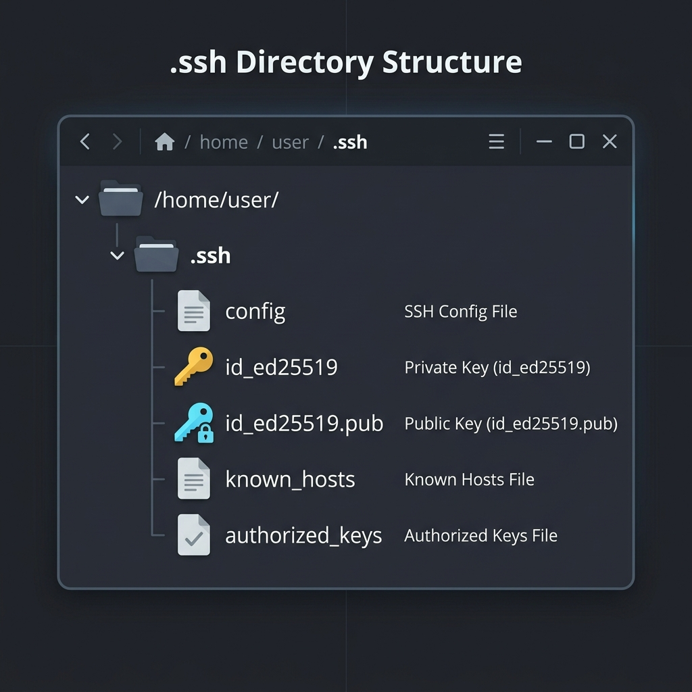
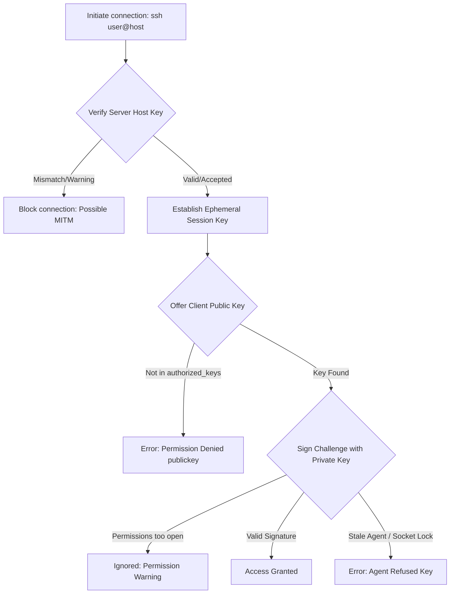
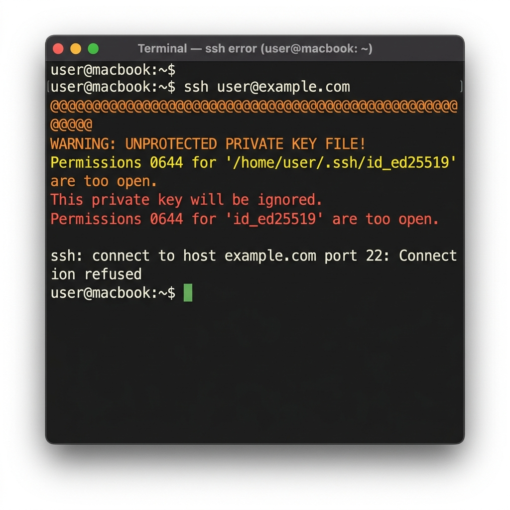
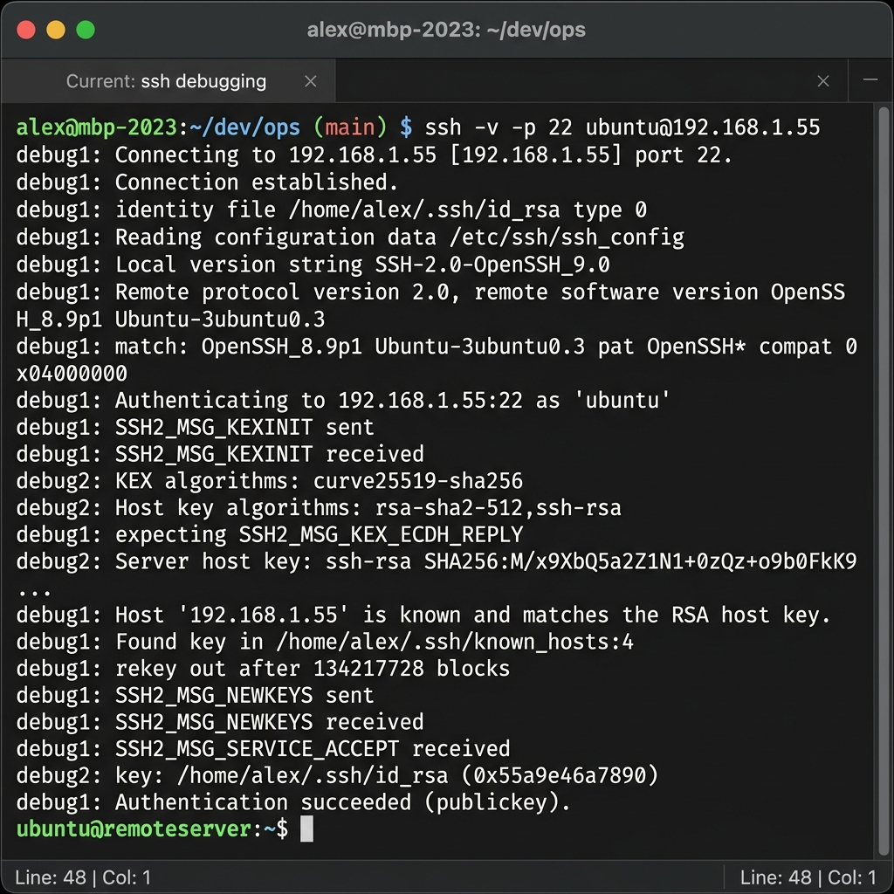
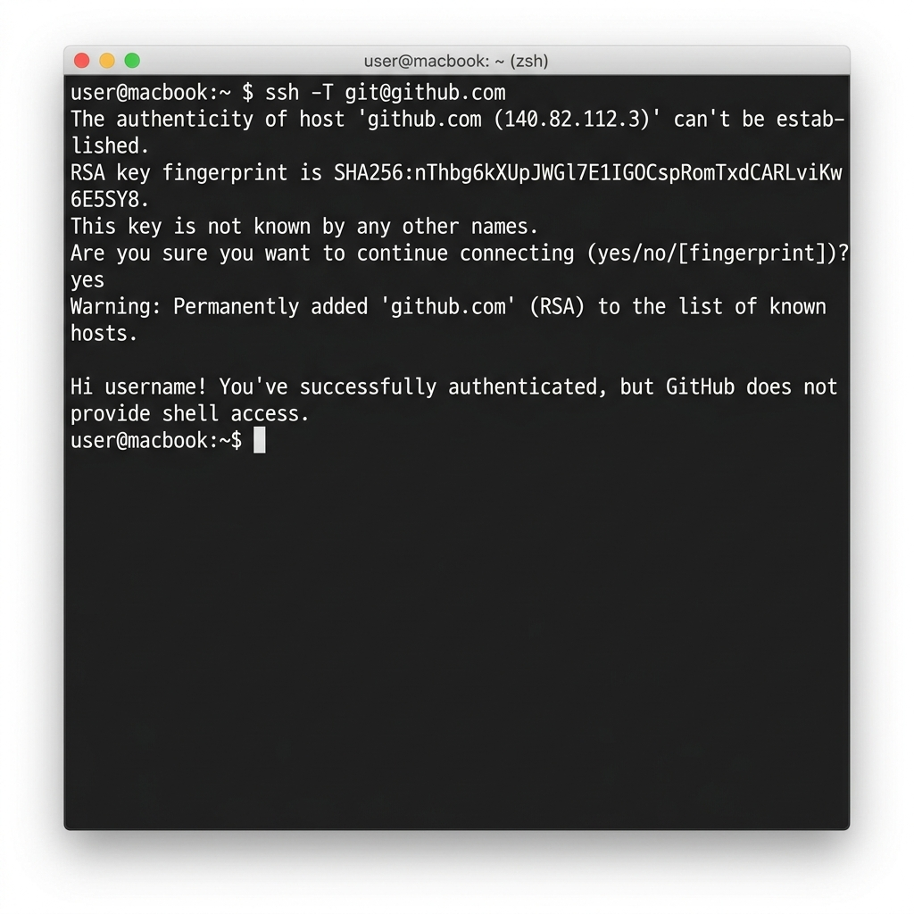

*Last updated: June 18, 2026*

Transitioning to Ed25519 keys is one of the best upgrades you can make for your development workflow. They are fast, secure, and compact. However, configuring public key authentication is not always seamless. If directory permissions are slightly misconfigured, files are converted incorrectly, or a remote server lacks support, you will encounter frustrating **Ed25519 errors** during connection handshakes.

Cryptographic issues can be difficult to diagnose because security tools are designed to fail silently to prevent leaking information to potential attackers. In this guide, we will troubleshoot common SSH and Git authentication failures on Linux, macOS, and Windows. We will look at real world scenarios involving GitHub, GitLab, custom Linux servers, and cloud VPS deployments in AWS and DigitalOcean.

> **Featured Snippet: What is an Ed25519 error?**
> An Ed25519 error refers to a configuration, permission, or format failure that prevents an SSH client or Git system from successfully authenticating using an Ed25519 public-private key pair.

---

## Table of Contents
1. [Common Ed25519 Errors at a Glance](#common-ed25519-errors-at-a-glance)
2. [Before You Begin](#before-you-begin)
3. [SSH Authentication Flow](#ssh-authentication-flow)
4. [Error 1: Unprotected Private Key File (Permissions Error)](#error-1-unprotected-private-key-file-permissions-error)
5. [Error 2: Permission Denied (publickey)](#error-2-permission-denied-publickey)
6. [Error 3: Invalid Key Format (Conversion Issues)](#error-3-invalid-key-format-conversion-issues)
7. [Error 4: Agent Refused Key](#error-4-agent-refused-key)
8. [Error 5: Server Rejected Key (Unsupported Key Type)](#error-5-server-rejected-key-unsupported-key-type)
9. [When Should You Use RSA Instead of Ed25519?](#when-should-you-use-rsa-instead-of-ed25519)
10. [Troubleshooting FAQs](#troubleshooting-faqs)
11. [Conclusion](#conclusion)
12. [About the Author](#about-the-author)
13. [References](#references)

---

## Common Ed25519 Errors at a Glance

Before walking through the detailed solutions, here is a quick summary of the most common errors, their root causes, and how to resolve them:

| Error Message | Root Cause | Fast Solution Command |
| :--- | :--- | :--- |
| **Permissions too open (0644)** | Private key file has unsafe permissions | `chmod 600 ~/.ssh/id_ed25519` |
| **Permission denied (publickey)** | Public key not registered on the remote server | `ssh-copy-id user@host` or paste in GitHub/GitLab |
| **invalid format** | Mixing PuTTY .ppk and OpenSSH key formats | Convert key format using PuTTYgen |
| **signing failed: agent refused key** | SSH agent socket is stale or permissions are locked | Restart the agent and reload keys |
| **connection refused / ignores key** | Legacy server does not support Ed25519 keys | Generate a 3072-bit RSA fallback key |

---

## Before You Begin

Before you attempt to resolve any cryptographic errors, make sure your local environment is configured correctly. Follow these three preparation steps to establish a clean starting point.

### 1. Verify the OpenSSH Version
Support for Ed25519 keys requires OpenSSH version 6.5 or newer (released in 2014). To verify your local client version, open your terminal or PowerShell and run:

```bash
ssh -V
```

If your client version is older than 6.5, you must upgrade your operating system's OpenSSH package before continuing.

### 2. Back Up Existing SSH Keys
When troubleshooting key permissions or file formats, it is easy to accidentally overwrite or delete active credentials. Create a secure local backup of your entire SSH directory before making changes:

* **On Linux, macOS, or WSL:**
  ```bash
  cp -r ~/.ssh ~/.ssh_backup
  ```
* **On Windows (PowerShell):**
  ```powershell
  Copy-Item -Recurse -Force -Path "$env:USERPROFILE\.ssh" -Destination "$env:USERPROFILE\.ssh_backup"
  ```

### 3. Locate Your SSH Directory
By default, your SSH private key and public key are saved inside a hidden directory named `.ssh` in your home folder. 

* **Unix/macOS/WSL:** `/home/username/.ssh/` (represented as `~/.ssh/`)
* **Windows:** `C:\Users\username\.ssh\` (represented as `%USERPROFILE%\.ssh\`)

Below is a diagram of the typical files found in a correctly configured SSH directory:



---

## SSH Authentication Flow

The diagram below outlines the sequence of checks performed during an SSH key authentication handshake. Understanding this flow makes it much easier to pinpoint where a connection fails:



---

## Error 1: Unprotected Private Key File (Permissions Error)

### The Symptoms
When you attempt to connect over SSH or perform Git SSH authentication, your terminal displays a warning block and refuses to use the key:

```text
@@@@@@@@@@@@@@@@@@@@@@@@@@@@@@@@@@@@@@@@@@@@@@@@@@@@@@@@@@@
@         WARNING: UNPROTECTED PRIVATE KEY FILE!          @
@@@@@@@@@@@@@@@@@@@@@@@@@@@@@@@@@@@@@@@@@@@@@@@@@@@@@@@@@@@
Permissions 0644 for '/home/user/.ssh/id_ed25519' are too open.
It is required that your private key files are NOT accessible by others.
This private key will be ignored.
```

An example of this permission warning in a terminal looks like this:



### Why it Happens
OpenSSH enforces strict security parameters. An SSH private key represents your identity, so the client software rejects the key if other user accounts on your local machine can read the file. A permission configuration of `0644` means the file is readable by everyone, which triggers this warning.

### The Solutions

#### On Linux, macOS, and WSL:
Open your terminal and use the `chmod` utility to restrict permissions:

```bash
# Set private key to read/write by owner only (600)
chmod 600 ~/.ssh/id_ed25519

# Set public key to read-write by owner, read-only by others (644)
chmod 644 ~/.ssh/id_ed25519.pub

# Set the hidden folder permissions (700)
chmod 700 ~/.ssh
```

#### On Windows (PowerShell):
Windows uses Access Control Lists (ACLs). You must disable permission inheritance and remove access for default user groups:

```powershell
$path = "$env:USERPROFILE\.ssh\id_ed25519"
# Disable inheritance and copy active permissions
icacls $path /c /t /inheritance:d
# Grant full access to current user only
icacls $path /c /t /grant:r "$($env:USERNAME):(F)"
# Remove access for Everyone and Users groups
icacls $path /c /t /remove "Everyone"
icacls $path /c /t /remove "Users"
```

### Verify the Fix
To verify that the permissions are correct, list the files in your directory and check the permission string:

```bash
ls -l ~/.ssh/id_ed25519
```

The output should show `-rw-------` (which corresponds to octal code `600`), indicating that only your user account has read and write access.

---

## Error 2: Permission Denied (publickey)

### The Symptoms
Your connection terminates immediately before prompting for a password:

```text
git@github.com: Permission denied (publickey).
```

### Why it Happens
This is the most common of all SSH authentication errors. It indicates that the client offered your public key, but the remote server compared it against its registration files and rejected it. Typical causes include:
* The public key was not added to the server's `authorized_keys` file.
* You have not uploaded your public key to your GitHub or GitLab profile.
* Your local client is not offering the correct key because the SSH agent has not loaded it.

> **Featured Snippet: What causes "Permission denied (publickey)"?**
> This error is caused when the SSH client offers a public key that does not match any key stored in the remote server's `authorized_keys` file or registered in your Git profile.

### The Solutions

#### 1. Verify Your Key is Loaded
If you have a passphrase-protected key, your client might not offer it automatically. Check which keys are loaded in your active `ssh-agent`:

```bash
ssh-add -l
```

If the agent returns `The agent has no identities`, run `ssh-add` to register your private key:

```bash
ssh-add ~/.ssh/id_ed25519
```

#### 2. Run Verbose Diagnostics
To see exactly what keys your client is offering during the handshake, run the connection in verbose mode:

```bash
ssh -vT git@github.com
```

In the output, look for the following lines to confirm the client is offering your Ed25519 key:



If the server accepts the key, the terminal will display a successful verification greeting:



#### 3. Inspect Remote Server Permissions
If you are logging into your own Linux server, verify that the remote `authorized_keys` file contains the exact contents of your `id_ed25519.pub` file, and check that the server-side directory permissions are secure:

```bash
# On the remote server:
chmod 700 ~/.ssh
chmod 600 ~/.ssh/authorized_keys
```

### Verify the Fix
To verify that the issue is resolved, test the connection to GitHub or your server:

```bash
ssh -T git@github.com
```

The server should greet you by your username, confirming that public key authentication is functioning.

---

## Error 3: Invalid Key Format (Conversion Issues)

### The Symptoms
The SSH client fails to parse your private key file, printing:

```text
Load key "/home/user/.ssh/id_ed25519": invalid format
```

### Why it Happens
This error occurs when an SSH utility receives a private key file saved in a format it does not recognize. This typically happens when developers use PuTTY's custom `.ppk` files with OpenSSH command line tools, or attempt to use raw OpenSSH private keys in older Windows applications.

> **Featured Snippet: What does "invalid key format" mean?**
> An "invalid key format" error indicates that the SSH client is reading a private key file formatted for a different SSH implementation, such as using a PuTTY `.ppk` file with OpenSSH.

### The Solutions

#### Converting a PuTTY Key (.ppk) to OpenSSH Format
If you generated your key on Windows using PuTTYgen and need the standard format for macOS or Linux, convert the file:

1. Launch **PuTTYgen** on Windows.
2. Select **File** -> **Load private key** and open your `.ppk` file.
3. Go to the top menu and select **Conversions** -> **Export OpenSSH key**.
4. Save the file in your `.ssh` directory as `id_ed25519` without an extension.

#### Converting an OpenSSH Key to PuTTY Format (.ppk)
If you generated your key using `ssh-keygen` and need it for PuTTY or WinSCP:

1. Launch **PuTTYgen**.
2. Go to **Conversions** -> **Import key** and load your `id_ed25519` file.
3. Enter the passphrase when prompted.
4. Click **Save private key** to output the `.ppk` file.

### Verify the Fix
To confirm that your private key is now saved in a valid format, run the public key generation check:

```bash
ssh-keygen -y -f ~/.ssh/id_ed25519
```

If the format is correct, the command will output your public key string (e.g., `ssh-ed25519 AAAAC3...`) without error.

---

## Error 4: Agent Refused Key

### The Symptoms
During connection negotiation, the client displays a signing failure:

```text
debug1: sign_and_send_pubkey: signing failed: agent refused key
```

### Why it Happens
This error occurs when the SSH client matches a public key in the server's database but cannot sign the challenge because the local `ssh-agent` refuses to perform the operation. This typically happens if the agent's communication socket is locked, permissions are corrupt, or the socket environment variable is broken.

> **Featured Snippet: What is "agent refused key"?**
> An "agent refused key" error occurs when the SSH agent process is running but refuses to perform the challenge-signing handshake, usually due to stale background sockets or permission locks.

### The Solutions

#### 1. Restart the SSH Agent
On Linux or macOS, kill the stale agent process and start a fresh session to clear socket locks:

```bash
# Kill active agent processes
killall ssh-agent
# Start a new agent session
eval "$(ssh-agent -s)"
# Re-add your private key
ssh-add ~/.ssh/id_ed25519
```

#### 2. Resolve Agent Bridging Issues
If you are running Windows Subsystem for Linux (WSL), the bridge between the Windows host agent (like Pageant) and the Linux environment can occasionally hang. Restart your agent bridge script to restore connection socket endpoints:

```bash
# Example if using wsl-ssh-agent-bridge
wsl-ssh-agent-bridge -r
```

### Verify the Fix
To verify that the agent is responsive and holding your key, query the active keys list:

```bash
ssh-add -l
```

The command should output the fingerprint and email comment of your Ed25519 key without returning any socket errors.

---

## Error 5: Server Rejected Key (Unsupported Key Type)

### The Symptoms
Your client offers your Ed25519 key, but the verbose logs show the server ignores it completely, falling back to a password prompt:

```text
debug1: Offering public key: /home/user/.ssh/id_ed25519 ED25519 SHA256:...
debug1: Authentications that can continue: publickey,password
debug1: Next authentication method: password
```

### Why it Happens
This issue occurs when you attempt to connect to older systems, legacy network appliances, or servers running OpenSSH versions older than 6.5. These older server environments **do not implement support for Ed25519 keys**. It is a software support limitation rather than a mathematical capability issue.

> **Featured Snippet: Can older servers use Ed25519?**
> No, older servers running OpenSSH versions older than 6.5 (released in 2014) do not implement support for Ed25519 keys and will ignore them during the handshake.

### The Solutions
If the remote server's OpenSSH version cannot be updated, you must fall back to generating a secure, large RSA key pair (using at least 3072 bits):

```bash
ssh-keygen -t rsa -b 3072 -C "fallback_compatibility_key"
```

Configure your local SSH config file (`~/.ssh/config`) to use this fallback key specifically for the legacy host:

```text
Host legacy-server.com
    IdentityFile ~/.ssh/fallback_compatibility_key
```

### Verify the Fix
Test the connection to the legacy server in verbose mode:

```bash
ssh -v -i ~/.ssh/fallback_compatibility_key user@legacy-server.com
```

The log should verify that the server successfully accepted the RSA key for authentication.

---

## When Should You Use RSA Instead of Ed25519?

While Ed25519 is the modern standard, RSA remains necessary in specific enterprise environments and legacy scenarios.

### 1. Legacy OpenSSH Installations
Many enterprise networks use legacy Linux installations (such as Red Hat Enterprise Linux 6 or older Debian releases) that have not been updated. Because these systems run versions of OpenSSH that predated the introduction of Curve25519 support in 2014, they cannot parse Ed25519 public keys.

### 2. Hardware Security Modules (HSMs) and Smart Cards
Older HSMs and physical smart cards use custom hardware acceleration chips designed specifically for RSA's modular exponentiation math. Because they lack the hardware processors required for elliptic curve math, they cannot generate or load Ed25519 keys.

For a comprehensive comparison of security margins and key scaling laws between these two algorithms, see our [Ed25519 vs RSA guide](/blog/ed25519-vs-rsa/).

---

## Troubleshooting FAQs

### Q1: Can I use one Ed25519 key for multiple GitHub accounts?
No. GitHub requires each SSH public key to be associated with a single account to identify commits uniquely. If you attempt to add the same key to a second account, you will receive a "Key already in use" error. You must generate a unique key pair for each account and manage them using an SSH config file.

### Q2: Does Ed25519 work natively on Windows?
Yes. Modern versions of Windows 10 and Windows 11 include a native port of OpenSSH. You can use standard command line utilities like `ssh-keygen` and `ssh` directly inside PowerShell or Windows Terminal.

### Q3: Should I password-protect my Ed25519 private key?
Yes. If you leave the passphrase blank, anyone who gains physical or remote access to your local computer's filesystem can steal the key and access your remote accounts. Setting a passphrase encrypts the private key file on disk using the secure bcrypt key derivation function.

### Q4: Can I convert an RSA key to Ed25519?
No. RSA and Ed25519 are based on different mathematical foundations (prime integer factorization vs. elliptic curve discrete logarithms). You cannot convert or migrate keys between them. You must generate a new Ed25519 key pair.

### Q5: How do I regenerate an Ed25519 key safely?
If you suspect your key has been compromised, generate a new key pair using `ssh-keygen -t ed25519`. Upload the new public key to your servers, verify that the new connection is working, and then delete the old public key from the server's `authorized_keys` file to revoke it.

---

## Conclusion

Resolving Ed25519 errors is straightforward once you verify the underlying file formats, directory permissions, and software versions. 
* Secure your private key file by setting its permissions to `600`.
* Check that your keys are loaded in the SSH agent.
* Maintain a secure 3072-bit RSA fallback key when working with legacy server environments that do not support elliptic curves.

For more details on key management, read our [id_ed25519 guide](/blog/id_ed25519/) or check our guide on [how to generate an Ed25519 SSH key](/ed25519-ssh-key/).

---

## About the Author

**Written by Zeeshan Tariq**

Software engineer focused on cryptography, authentication systems, and full Stack Development. Zeeshan has designed secure authentication integrations for enterprise cloud systems and regularly audits cryptographic configurations.

*Note: The commands and steps in this article were tested and verified using OpenSSH version 9.6 on macOS Sonoma, Ubuntu Linux 22.04, and Windows 11.*

---

## References
1. OpenSSH Project. (2024). *ssh manual page*. [https://man.openbsd.org/ssh](https://man.openbsd.org/ssh)
2. Microsoft Corporation. (2021). *OpenSSH key management on Windows*. Microsoft Learn. [https://learn.microsoft.com/en-us/windows-server/administration/openssh/openssh_keymanagement](https://learn.microsoft.com/en-us/windows-server/administration/openssh/openssh_keymanagement)
3. Mozilla. (2023). *Mozilla OpenSSH Security Guidelines*. [https://infosec.mozilla.org/guidelines/openssh.html](https://infosec.mozilla.org/guidelines/openssh.html)
4. IETF. (2017). *Edwards-Curve Digital Signature Algorithm (EdDSA)*. RFC 8032. [https://tools.ietf.org/html/rfc8032](https://tools.ietf.org/html/rfc8032)

<script type="application/ld+json">
{
  "@context": "https://schema.org",
  "@type": "Article",
  "headline": "Common Ed25519 Errors and Solutions: A Troubleshooting Guide",
  "description": "A developer guide to diagnosing and fixing common errors with Ed25519 keys, permissions, agent forwarding, and format conversions.",
  "author": {
    "@type": "Person",
    "name": "Zeeshan Tariq"
  },
  "datePublished": "2026-06-18",
  "dateModified": "2026-06-18"
}
</script>

<script type="application/ld+json">
{
  "@context": "https://schema.org",
  "@type": "FAQPage",
  "mainEntity": [
    {
      "@type": "Question",
      "name": "Can I use one Ed25519 key for multiple GitHub accounts?",
      "acceptedAnswer": {
        "@type": "Answer",
        "text": "No. GitHub requires each SSH public key to be associated with a single account to identify commits uniquely. You must generate a unique key pair for each account."
      }
    },
    {
      "@type": "Question",
      "name": "Does Ed25519 work natively on Windows?",
      "acceptedAnswer": {
        "@type": "Answer",
        "text": "Yes. Modern versions of Windows 10 and Windows 11 include a native port of OpenSSH, allowing you to use commands like ssh-keygen directly in PowerShell."
      }
    },
    {
      "@type": "Question",
      "name": "Should I password-protect my Ed25519 private key?",
      "acceptedAnswer": {
        "@type": "Answer",
        "text": "Yes. If you leave the passphrase blank, anyone who gains access to your files can steal the key. Setting a passphrase encrypts the private key on disk."
      }
    },
    {
      "@type": "Question",
      "name": "Can I convert an RSA key to Ed25519?",
      "acceptedAnswer": {
        "@type": "Answer",
        "text": "No. RSA and Ed25519 are based on different mathematical foundations. You cannot convert keys between them; you must generate a new Ed25519 key pair."
      }
    },
    {
      "@type": "Question",
      "name": "How do I regenerate an Ed25519 key safely?",
      "acceptedAnswer": {
        "@type": "Answer",
        "text": "Generate a new key pair using ssh-keygen -t ed25519, upload the new public key to your servers, test the connection, and then remove the old key from authorized_keys."
      }
    }
  ]
}
</script>
