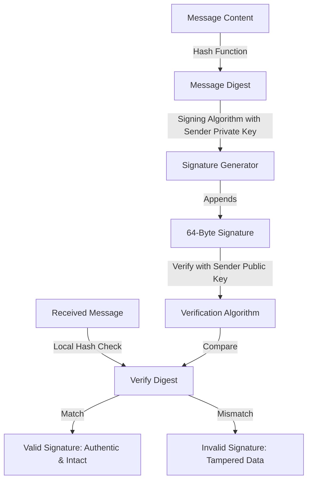
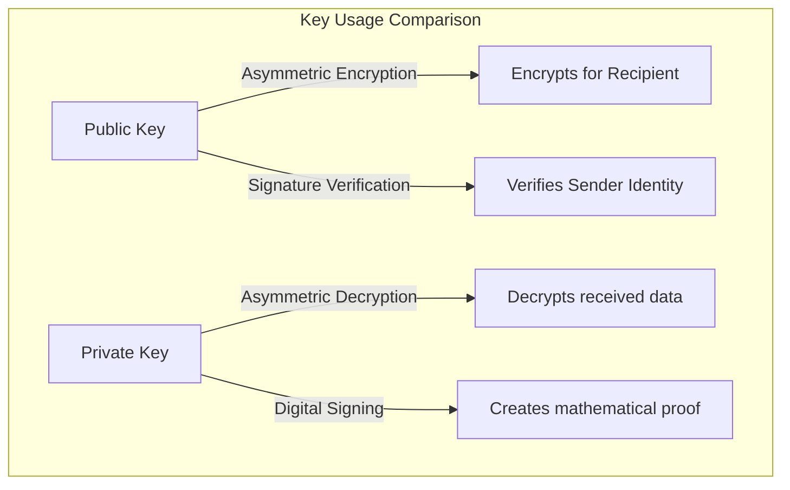

*Last updated: June 18, 2026*

When designing secure software or configuring web servers, developers utilize two primary cryptographic operations: encryption and digital signatures. While both rely on the principles of public key cryptography, they solve completely different security problems. Confusing these two terms is common, but making a mistake in their implementation can break the security of your communication channels.

Understanding the direct trade-offs of **digital signature vs encryption** is critical for secure software development. Encryption is designed to hide data from unauthorized eyes, ensuring confidentiality. In contrast, digital signatures are designed to prove authorship and verify that the data has not been altered, ensuring authenticity and integrity.

> **Featured Snippet: What is the difference between digital signatures and encryption?**
> The primary difference between digital signatures and encryption is their security goal. Encryption scrambles plaintext into ciphertext to ensure data confidentiality, while a digital signature creates a cryptographic digest using a private key to prove sender authenticity and message integrity.

---

## Table of Contents
1. [Digital Signature vs. Encryption: Quick Comparison](#digital-signature-vs-encryption-quick-comparison)
2. [What is Encryption?](#what-is-encryption)
3. [What is a Digital Signature?](#what-is-a-digital-signature)
4. [Key Management: Who Uses Which Key?](#key-management-who-uses-which-key)
5. [When Should You Use Encryption?](#when-should-you-use-encryption)
6. [When Should You Use Digital Signatures?](#when-should-you-use-digital-signatures)
7. [Why Modern Applications Use Both Together](#why-modern-applications-use-both-together)
8. [Common Real-World Applications](#common-real-world-applications)
9. [Code Example: Sign and Encrypt in Python](#code-example-sign-and-encrypt-in-python)
10. [Troubleshooting FAQs](#troubleshooting-faqs)
11. [Conclusion](#conclusion)
12. [About the Author](#about-the-author)
13. [References](#references)

---

## Digital Signature vs Encryption: Quick Comparison

Before exploring the technical details, here is an at-a-glance comparison table summarizing the core differences:

| Property | Encryption | Digital Signature |
| :--- | :--- | :--- |
| **Primary Goal** | Confidentiality (hiding data). | Authenticity and integrity (proving authorship). |
| **Mathematical Role** | Scrambles plaintext into unreadable ciphertext. | Generates a verification mathematical digest. |
| **Key for Initiator** | Recipient's public key (asymmetric) or shared key. | Sender's private key. |
| **Key for Responder** | Recipient's private key (asymmetric) or shared key. | Sender's public key. |
| **Output Data** | Scrambled ciphertext. | The original message plus a signature block. |
| **Non-Repudiation** | No (anyone can encrypt with a public key). | Yes (only the private key owner can sign). |
| **CIA Triad Pillar** | Confidentiality. | Integrity and Authenticity. |
| **Common Algorithms** | AES-GCM, ChaCha20, RSA-OAEP, X25519. | Ed25519, ECDSA, RSA-PSS. |

---

## What is Encryption?

> **Featured Snippet: What is encryption?**
> Encryption is the process of scrambling readable plaintext data into ciphertext using a key. This ensures that only authorized parties holding the corresponding decryption key can read the message.

Encryption is designed to protect data confidentiality. In asymmetric cryptography, this process relies on a key pair. If Alice wants to send a secret message to Bob:

1. Alice retrieves Bob's **public key**.
2. Alice runs the encryption algorithm, which transforms the readable plaintext into scrambled ciphertext.
3. Alice transmits the ciphertext across the internet.
4. Bob receives the ciphertext and uses his **private key** to decrypt the data back into plaintext.

If an eavesdropper intercepts the encrypted packet, they only see scrambled characters. They cannot reverse the operation because they do not hold Bob's private key.

### Encryption Workflow


---

## What is a Digital Signature?

> **Featured Snippet: What is a digital signature?**
> A digital signature is a mathematical proof generated over a message using a sender's private key. It allows recipients holding the sender's public key to verify that the message is authentic and has not been altered.

Digital signatures protect data integrity and authenticity. While older signature explanations state that "the sender encrypts the message digest with their private key," this is technically simplified. Modern digital signature algorithms, such as **Ed25519**, do not literally encrypt the hash. Instead, they combine the message and the private key using a signing algorithm to produce a signature value.

To sign a message:
1. The sender's software hashes the message to generate a short, unique digest.
2. The sender's software uses the **private key** and the digest to compute a digital signature (consisting of coordinate points and scalars).
3. The sender transmits both the message and the signature.
4. The recipient computes the message digest locally, and uses the **sender's public key** to verify the signature. If the mathematical validation balances, the signature is authentic.

### Digital Signature Workflow



To learn more about how signature math works on modern curves, see our guide on [signing and verifying with Ed25519](/blog/signing-and-verifying-with-ed25519/).

---

## Key Management: Who Uses Which Key?

The core difference between these operations lies in the keys used by each participant:



* **To encrypt data:** You use the **recipient's public key**. Only the recipient can decrypt the data using their matching **private key**.
* **To sign data:** You use your own **private key** to generate the signature. Anyone can verify the signature using your public key.

---

## When Should You Use Encryption?

> **Featured Snippet: Can encryption provide authentication?**
> No. Asymmetric encryption alone cannot provide sender authentication. Because anyone can encrypt a message using the recipient's public key, the recipient cannot prove who actually sent the message.

You should use encryption when your primary security goal is **data confidentiality**. This includes:
* **Hiding Data:** Protecting database columns, files on disk, or API payloads from unauthorized access.
* **Secure Session Handshakes:** Exchanging ephemeral keys during a connection handshake (such as a [TLS Handshake](/blog/ssh-key-authentication-explained/)) to establish a secure, private tunnel.
* **End-to-End Encryption (E2EE):** Encrypting messages in transit so that network operators and service providers cannot read the contents.

### Example: Encrypting Without Signing
Imagine Alice sends Bob a sensitive banking instruction: *"Transfer $1,000 to Account A."* Alice encrypts the message using Bob's public key. The message is private, meaning no one can read it on the wire. 

However, because Alice did not sign the message, an active attacker on the network can intercept the encrypted packet and replace it with their own encrypted message: *"Transfer $5,000 to Account B."* Because the attacker used Bob's public key to encrypt the malicious instruction, Bob's server will decrypt it successfully. Bob's system has no way of verifying that the message came from Alice, exposing the system to transaction fraud.

---

## When Should You Use Digital Signatures?

> **Featured Snippet: Can digital signatures provide confidentiality?**
> No. Digital signatures do not provide confidentiality. The original message is sent in plaintext alongside the signature, meaning anyone can read the contents.

You should use digital signatures when your security goals are **data integrity, authenticity, and non-repudiation**. This includes:
* **Software Signing:** Verifying that installer packages, updates, or Git commits have not been modified. Read more in our guide on [how Git commit signing works](/blog/how-git-commit-signing-works/).
* **SSH Authentication:** Logging into remote servers without passwords, where the client proves ownership of their private key by signing a challenge. For configuration details, see [SSH authentication explained](/blog/ssh-key-authentication-explained/).
* **Document Signing:** Executing digital contracts where the signer must be authenticated.

### Example: Signing Without Encrypting
Imagine a Linux distribution provider releases a new software package. They do not need to encrypt the package because it is public software meant for everyone to download. 

However, they must protect the package integrity. The provider signs the package metadata using their private key. When you download the package, your system verifies the signature using the provider's public key. If a malicious mirror website modifies the package to inject malware, the signature verification fails, protecting your operating system.

### Understanding Non-Repudiation
Non-repudiation is a critical property of digital signatures. It means the signer cannot deny having signed a message. 

For example, in a digital mortgage contract, the buyer signs the document using their private key. Because only the buyer holds the private key, the lender can present the signature in court as mathematical proof that the buyer executed the contract. If symmetric keys were used, either party could have generated the signature, making it legally invalid.

---

## Why Modern Applications Use Both Together

In secure communication, applications rarely choose between encryption and digital signatures. They use both together in a framework called **Authenticated Encryption**.

To protect the CIA Triad, systems use **hybrid encryption**:

1. **Verify Identity:** The client uses [Digital Certificates](/blog/github-ssh-host-key-fingerprint-ed25519/) to verify the server's public key.
2. **Establish the Key:** The client and server run an ephemeral key exchange (like X25519) to negotiate a temporary symmetric key.
3. **Secure the Channel:** The system encrypts all data using authenticated encryption ciphers (like AES-GCM or ChaCha20-Poly1305) which build integrity verification directly into the encrypted payload.

This combined workflow guarantees confidentiality, authenticity, and integrity.


---

## Common Real-World Applications

Asymmetric keys secure the modern internet through several standard protocols:

* **HTTPS/TLS:** Web browsers verify the site's identity using digital certificates and encrypt all traffic using hybrid encryption.
* **SSH (Secure Shell):** Uses key agreement to encrypt terminal connections, and client key pairs to authenticate users.
* **Email (PGP/S-MIME):** Encrypts the email body to keep it private, and signs it to verify the sender.
* **Cryptocurrency Transactions:** Networks like Bitcoin and Solana use signatures to authorize transactions from account addresses.
* **Software Updates:** Operating systems verify the digital signatures of updates before executing installations.

---

## Code Example: Sign and Encrypt in Python

Below is a Python implementation showing how to sign a message using an Ed25519 key, and then encrypt the message using a symmetric cipher. 

*Note: In production systems, developers use hybrid encryption with ephemeral key exchanges (like X25519 + AES-GCM). Fernet is used here for demonstration purposes.*

```python
from cryptography.hazmat.primitives.asymmetric import ed25519
from cryptography.fernet import Fernet
import binascii

# 1. Generate Ed25519 Signing Keys
signing_key = ed25519.Ed25519PrivateKey.generate()
verification_key = signing_key.public_key()

# Cryptographic plaintext definition
plaintext_message = b"Transaction payload: Transfer $500 to user account."

# 2. Generate the Digital Signature
# Modern Ed25519 calculates the signature using deterministic algorithms
signature = signing_key.sign(plaintext_message)
print(f"Ed25519 Signature (64 bytes / hex): {binascii.hexlify(signature).decode()}")

# 3. Generate a Symmetric Key for Encryption (Fernet/AES)
symmetric_key = Fernet.generate_key()
cipher = Fernet(symmetric_key)

# 4. Encrypt the plaintext message to ensure confidentiality
ciphertext = cipher.encrypt(plaintext_message)
print(f"Ciphertext (base64): {ciphertext.decode()[:60]}...")

# --- On the receiving end ---

# 5. Decrypt the ciphertext using the shared symmetric key
decrypted_data = cipher.decrypt(ciphertext)

# 6. Verify the digital signature to ensure authenticity and integrity
try:
    verification_key.verify(signature, decrypted_data)
    print("Verification Successful: Message is authentic and intact.")
except Exception as e:
    print("Verification Failed: Data tampered or key mismatch.", str(e))
```

---

## Troubleshooting FAQs

### Q1: Which is more secure: encryption or digital signatures?
Neither is "more secure" because they solve different problems. Encryption protects confidentiality (privacy), while digital signatures protect integrity and authenticity (authorship). A secure system requires both.

### Q2: Can digital signatures replace encryption?
No. Digital signatures do not hide data. A signed message is sent in plaintext alongside the signature. If your data must remain secret, you must encrypt it.

### Q3: Does HTTPS use encryption or digital signatures?
It uses both. During the TLS handshake, the browser verifies the server's identity using digital signatures (certificates). They then negotiate a shared key to encrypt all subsequent traffic using symmetric ciphers.

### Q4: Why are separate key pairs recommended for signing and encryption?
Using the same key pair for both signing and encryption introduces cross-protocol vulnerabilities where output from one algorithm can be used to exploit another. Separating keys is a fundamental security best practice. Refer to our [X25519 vs Ed25519 comparison](/blog/x25519-vs-ed25519/) for details.

### Q5: Are digital signatures legally valid?
Yes. In many jurisdictions (such as the ESIGN Act in the United States and eIDAS in the European Union), cryptographically verified digital signatures carry the same legal weight as handwritten signatures.

### Q6: What algorithms are commonly used for encryption vs digital signatures?
* **Encryption:** AES-GCM, ChaCha20, RSA-OAEP, X25519.
* **Digital Signatures:** Ed25519, ECDSA, RSA-PSS.

---

## Conclusion

Understanding the difference between encryption and digital signatures is essential to building secure systems.
* Use **encryption** to protect data confidentiality, ensuring that unauthorized parties cannot read your files.
* Use **digital signatures** to protect data integrity and authenticity, proving who sent the message and verifying that it has not been modified.
* Combine both using **hybrid encryption** to secure modern web connections, SSH sessions, and Git operations.

For more information on modern key pairs, check out our guide on [what is Ed25519](/blog/what-is-ed25519/) or learn [how to add an SSH key to GitHub](/blog/how-to-add-ssh-key-to-github/).

---

## About the Author

**Written by Zeeshan Tariq**

Software engineer focused on cryptography, authentication systems, and full-stack development. Zeeshan has extensive experience in secure software development, DevOps, security engineering, and public key infrastructure (PKI) design.

---

## References
1. Bellare, M., & Namprempre, C. (2000). *Authenticated encryption: Relations among notions and analysis of the generic composition methods*. Advances in Cryptology - ASIACRYPT 2000, 531-545. [https://link.springer.com/chapter/10.1007/3-540-44448-3_41](https://link.springer.com/chapter/10.1007/3-540-44448-3_41)
2. Josefsson, S., & Liusvaara, I. (2017). *Edwards-Curve Digital Signature Algorithm (EdDSA)*. RFC 8032. IETF. [https://tools.ietf.org/html/rfc8032](https://tools.ietf.org/html/rfc8032)
3. National Institute of Standards and Technology. (2020). *Recommendation for Key Management: Part 1 – General*. NIST SP 800-57 Part 1 Rev. 5. [https://doi.org/10.6028/NIST.SP.800-57pt1r5](https://doi.org/10.6028/NIST.SP.800-57pt1r5)
4. Housley, R. (2004). *Cryptographic Message Syntax (CMS)*. RFC 3852. IETF. [https://tools.ietf.org/html/rfc3852](https://tools.ietf.org/html/rfc3852)

<script type="application/ld+json">
{
  "@context": "https://schema.org",
  "@type": "Article",
  "headline": "Digital Signature vs Encryption: What Is the Difference?",
  "description": "Discover the functional differences between digital signatures and encryption, how they secure communication, and how they are used together.",
  "author": {
    "@type": "Person",
    "name": "Zeeshan Tariq"
  },
  "datePublished": "2026-06-18",
  "dateModified": "2026-06-18"
}
</script>

<script type="application/ld+json">
{
  "@context": "https://schema.org",
  "@type": "FAQPage",
  "mainEntity": [
    {
      "@type": "Question",
      "name": "Which is more secure: encryption or digital signatures?",
      "acceptedAnswer": {
        "@type": "Answer",
        "text": "Neither is more secure because they solve different security goals. Encryption ensures confidentiality (privacy), while digital signatures ensure authenticity and integrity (authorship)."
      }
    },
    {
      "@type": "Question",
      "name": "Can digital signatures replace encryption?",
      "acceptedAnswer": {
        "@type": "Answer",
        "text": "No. Digital signatures do not hide data. A signed message is sent in plaintext alongside the signature. If data must remain secret, you must encrypt it."
      }
    },
    {
      "@type": "Question",
      "name": "Does HTTPS use encryption or digital signatures?",
      "acceptedAnswer": {
        "@type": "Answer",
        "text": "HTTPS uses both. It uses digital certificates (signatures) to verify the server identity, and then encrypts all traffic using symmetric ciphers."
      }
    },
    {
      "@type": "Question",
      "name": "Why are separate key pairs recommended?",
      "acceptedAnswer": {
        "@type": "Answer",
        "text": "Using the same key pair for both signing and encryption introduces cross-protocol vulnerabilities and complicates key backup policies."
      }
    },
    {
      "@type": "Question",
      "name": "Are digital signatures legally valid?",
      "acceptedAnswer": {
        "@type": "Answer",
        "text": "Yes. In most jurisdictions (like the ESIGN Act in the US and eIDAS in the EU), digital signatures hold the same legal validity as handwritten signatures."
      }
    }
  ]
}
</script>
