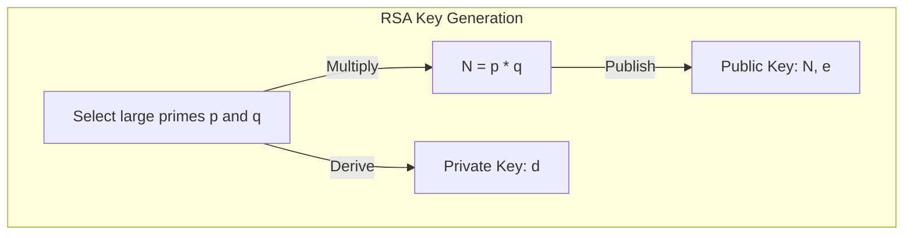
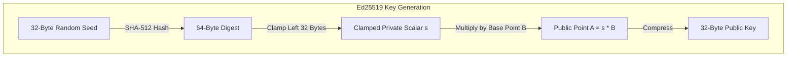
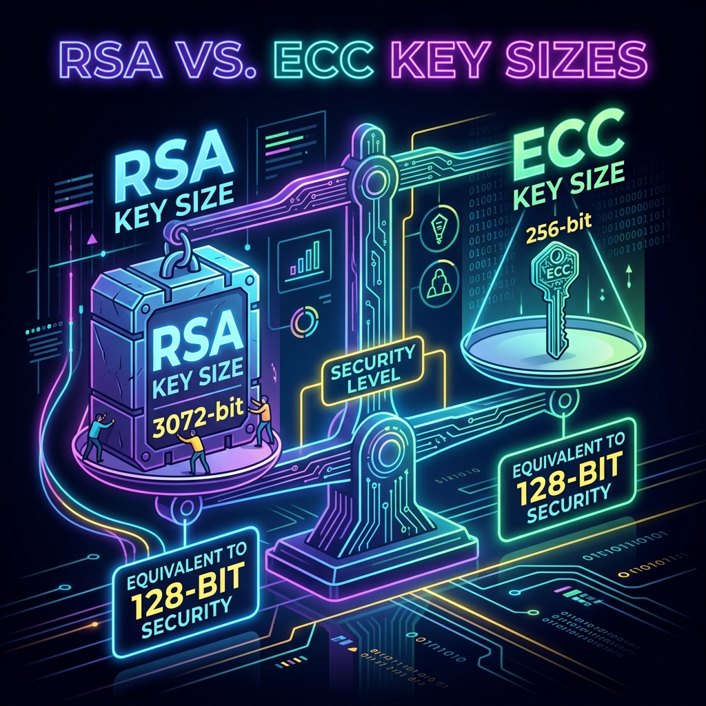

*Last updated: June 18, 2026*

For decades, asymmetric cryptography was dominated by a single name: RSA. Whether you were securing an SSH connection, establishing a secure HTTPS session, or signing a software package, RSA was the universal engine running under the hood. However, the cryptographic landscape has shifted. Today, choosing between **Ed25519 vs RSA** is a critical decision for developers configuring secure infrastructure.

**For new keys, choose Ed25519.** It is faster than RSA, its keys and signatures are a fraction of the size, and it sidesteps a class of implementation mistakes that have broken other schemes. Keep RSA only when you must talk to old systems that do not support Ed25519.

This guide provides an in-depth **SSH key comparison** of Ed25519 and RSA, exploring their mathematical foundations, security levels, performance characteristics, key sizes, and practical compatibility considerations.

> **Featured Snippet: What is the difference between Ed25519 and RSA?**
> The difference between Ed25519 and RSA lies in their mathematical design. Ed25519 uses modern Elliptic Curve Cryptography (Curve25519) to offer high security with tiny 256-bit keys, while RSA relies on integer factorization, requiring massive 3072-bit or 4096-bit keys to achieve the same security level.

---

## Which Should You Choose?

> **Which Should You Choose?**
> 
> * **Choose Ed25519 if:**
>   * You are creating new credentials for SSH, GitHub, GitLab, or Git commit signing.
>   * You need fast connection negotiation and low CPU usage.
>   * You want a constant-time, misuse-resistant algorithm.
> 
> * **Choose RSA if:**
>   * You must connect to legacy servers or network appliances that do not implement support for Ed25519 keys.
>   * Your organization is bound by compliance regimes that mandate RSA.

---

## Table of Contents
1. [Ed25519 vs RSA at a Glance](#ed25519-vs-rsa-at-a-glance)
2. [Understanding RSA: The Traditional Giant](#understanding-rsa-the-traditional-giant)
3. [Understanding Ed25519: The Modern Contender](#understanding-ed25519-the-modern-contender)
4. [Direct Head-to-Head Comparison](#direct-head-to-head-comparison)
5. [How Key Algorithms Handle Operations](#how-key-algorithms-handle-operations)
6. [Practical Applications: SSH, TLS, and Beyond](#practical-applications-ssh-tls-and-beyond)
7. [Real-World Recommendations](#real-world-recommendations)
8. [How to Migrate from RSA to Ed25519](#how-to-migrate-from-rsa-to-ed25519)
9. [Key Generation Side-by-Side](#key-generation-side-by-side)
10. [Troubleshooting FAQs](#troubleshooting-faqs)
11. [Conclusion](#conclusion)
12. [Further Reading](#further-reading)
13. [About the Author](#about-the-author)
14. [References](#references)

---

## Ed25519 vs RSA at a Glance

Below is a comparison of Ed25519 against a standard 3072-bit RSA key (which matches Ed25519's ~128-bit security level).

| Feature | Ed25519 | RSA (3072-bit) |
| :--- | :--- | :--- |
| **Mathematical Basis** | Twisted Edwards Curve (Curve25519) | Prime Integer Factorization |
| **Key Exchange/Type** | EdDSA (Edwards-curve Digital Signature Algorithm) | RSA Asymmetric Cryptosystem |
| **Private Key Size** | 256 bits (32 bytes)* | 3072 bits (384 bytes)** |
| **Public Key Size** | 256 bits (32 bytes) | ~3072 bits (~384 bytes) |
| **Signature Size** | 512 bits (64 bytes) | 3072 bits (384 bytes) |
| **Signing Speed** | Extremely Fast | Very Slow |
| **Verification Speed** | Fast | Extremely Fast |
| **Security Level** | ~128-bit symmetric equivalent | ~128-bit symmetric equivalent |
| **Misuse Resistance** | High (Deterministic, constant-time) | Medium (Dependent on padding & blinding) |
| **Standardization** | RFC 8032 | PKCS #1 / RFC 8017 |
| **Compatibility** | OpenSSH 6.5+ (2014), modern systems | Universal, legacy-compatible |

*\*Note: While the nominal private key size of Ed25519 is 256 bits, many implementations store it as a 32-byte seed or an expanded 64-byte private key containing the seed and public key.*
*\**Note: RSA private keys are significantly larger in serialized formats because they include CRT parameters and metadata, making the actual file size much larger than 384 bytes.*

---

## Understanding RSA: The Traditional Giant

### How RSA Works
Introduced in 1977 by Ron Rivest, Adi Shamir, and Leonard Adleman, RSA is one of the oldest public key cryptosystems. Its security relies on the **Integer Factorization Problem**. 

It is easy to multiply two large prime numbers, $p$ and $q$, to get $N = p \times q$. However, if you are only given $N$, finding $p$ and $q$ is extremely difficult once the numbers get large enough.



### The Problem of Scaling Key Sizes
As computing power has grown, mathematicians have developed faster ways to factor integers. The **General Number Field Sieve (GNFS)** is the most efficient known algorithm for factoring large integers, and it works sub-exponentially. 

Because factoring algorithms improve faster than brute-force search, RSA key sizes must grow at an accelerating rate to maintain security:
* **1024-bit RSA:** Weak, deprecated, and blocked by modern SSH clients.
* **2048-bit RSA:** The legacy standard, but no longer recommended.
* **3072-bit RSA:** The current standard recommended by NIST.
* **4096-bit RSA:** The maximum size for standard setups, but comes with a major performance penalty.
* To achieve **256-bit security** (matching AES-256), RSA would require a key size of **15,360 bits**, which is computationally impractical.

---

## Understanding Ed25519: The Modern Contender

### What is Ed25519?
Ed25519 is an implementation of the **Edwards-curve Digital Signature Algorithm (EdDSA)** using the twisted Edwards curve **Curve25519**. It was designed by a team of cryptographers led by Daniel J. Bernstein in 2011.

Unlike RSA, which is based on prime factorization, Ed25519 is based on **Elliptic Curve Cryptography (ECC)**. Instead of working with massive integers, ECC relies on the algebraic structure of elliptic curves over finite fields. Specifically, its security is derived from the **Elliptic Curve Discrete Logarithm Problem (ECDLP)**.



### Why ECC Keys are So Small
Because there is no sub-exponential algorithm like the General Number Field Sieve (GNFS) that applies to Curve25519, the math of ECC holds up much better against cryptanalysis. An attacker must solve the discrete logarithm problem, which can only be solved using algorithms that run in exponential time.

Consequently, a much smaller key size in ECC provides the same security as a massive key size in RSA:
* A **256-bit (32-byte) Ed25519 public key** provides approximately **128 bits of security**.
* To match this 128-bit security level, an RSA key must be **3072 bits (384 bytes)** long, which is twelve times larger than the Ed25519 key.

This key size difference is illustrated in the infographic below:



---

## Direct Head-to-Head Comparison

To understand why Ed25519 has taken over, we need to compare them across four critical dimensions: security, performance, size, and misuse resistance.

### 1. Security Level and Mathematical Strength
While both Ed25519 and 3072-bit RSA target a symmetric security level of roughly 128 bits, their mathematical resilience differs:
* **Quantum Resistance:** Although resource estimates differ, both RSA and Ed25519 are considered vulnerable to sufficiently capable quantum computers running Shor's algorithm. Neither offers post-quantum cryptography resistance.
* **Parameter Rigidity:** RSA security depends on the user selecting safe parameters (key size, prime generation methods, public exponent $e$, and padding schemes like PKCS#1 v1.5 or PSS). Ed25519 is rigid: there are no parameter choices. The curve, the base point, the hash function (SHA-512), and the encoding are all fixed by the specification. This eliminates the risk of choosing weak parameters.

### 2. Misuse Resistance: Preventing Implementation Failures
Historically, more cryptographic systems are broken by implementation flaws and side-channel leaks than by direct mathematical attacks. Ed25519 was designed specifically to eliminate these vulnerabilities:

* **Deterministic Nonces (No Randomness Leaks):** Traditional signature schemes like ECDSA and DSA require a cryptographically secure random number (a nonce) for every single signature. If the random number generator (RNG) is weak, repeats, or leaks even a few bits of entropy, an attacker can mathematically reconstruct the private key. Ed25519 eliminates this entire class of vulnerability by being **deterministic**. It generates its nonce by hashing the private key prefix along with the message being signed, removing the risk of private key leakage due to weak or repeating random nonces.
* **Constant-Time Execution:** Many cryptographic implementations leak information through timing attacks, which occur when an attacker measures how long an operation takes to execute to determine the values of the private key. RSA implementations must use complex blinding algorithms to prevent this, and even then, cache-timing attacks on modern CPUs remain a threat. Ed25519 is designed from the ground up to execute in constant time, ensuring that execution time, power consumption, and electromagnetic radiation remain identical regardless of the private key's value.

### 3. Key and Signature Sizes
Data transmission overhead is a major factor in modern network protocols, especially when thousands of connections are negotiated per second.

* **RSA-3072:**
  * Public Key: ~384 bytes
  * Private Key: ~1500 to ~3000 bytes (depending on format and inclusion of CRT parameters)
  * Signature: 384 bytes
* **Ed25519:**
  * Public Key: 32 bytes
  * Private Key: 32 bytes (or 64 bytes when the public key is appended)
  * Signature: 64 bytes

In scenarios like SSH authentication or TLS handshakes, transmitting an RSA public key and signature requires sending over 700 bytes of data. For Ed25519, the combination is just 96 bytes. In constrained networks, high-frequency signing environments, or when embedding signatures in database indexes or QR codes, Ed25519's small footprint is a massive advantage.

### 4. Performance and Speed
The computational differences between Ed25519 and RSA are stark. RSA is notoriously unbalanced: signature verification is extremely fast, but signing is incredibly slow. Ed25519 is highly balanced and optimized, offering blistering speed for both signing and verification.

* **Key Generation:** Generating an RSA key requires finding two large prime numbers, which involves generating random numbers and testing them for primality. This is a slow, variable-time process that can take hundreds of milliseconds or even seconds on low-power devices. Generating an Ed25519 key is instantaneous, simply requiring generating 32 random bytes.
* **Signing:** RSA signing requires a modular exponentiation using the large private exponent $d$, which is highly resource-intensive. Ed25519 signing is incredibly fast, performing thousands of operations per second even on modest hardware.
* **Verification:** RSA verification uses a small public exponent (typically $e = 65537$), making it very fast. In fact, RSA verification can sometimes be slightly faster than ECC verification. However, Ed25519 verification is also extremely fast, and because it processes much smaller keys and signatures, it often outperforms RSA in practice by reducing network and memory overhead.

---

## How Key Algorithms Handle Operations

The diagrams below compare the signing workflows for both algorithms:

### RSA Signing Workflow


### Ed25519 Signing Workflow
```mermaid
graph LR
    msg[Message] -->|SHA-512 with Private Prefix| hash[Deterministic Nonce r]
    hash -->|Point Multiplication r * B| rpoint[Commitment Point R]
    rpoint -->|Scalar Math s and h| ed[EdDSA Algorithm]
    ed -->|Generates| sig[64-Byte Signature R || S]
```

---

## Practical Applications: SSH, TLS, and Beyond

### SSH (Secure Shell)
When setting up SSH keys, Ed25519 is now the recommended default.
* **Why it matters:** Older RSA keys (especially 1024-bit keys) are unsafe. While 3072-bit or 4096-bit RSA keys are secure, they are slow to load and authenticate.
* **Support:** OpenSSH has supported Ed25519 since version 6.5 (released in 2014). Every modern operating system, including Linux distributions, macOS, and Windows 10/11, comes with a version of OpenSSH that supports Ed25519 by default.

### TLS and HTTPS
In TLS 1.3, static RSA key exchange has been completely removed to guarantee **Forward Secrecy**. Modern TLS 1.3 and SSH connections use a hybrid approach:
* **Digital Certificates:** Ed25519 is used for digital signatures in certificates where supported, verifying the server's identity.
* **Key Exchange:** X25519 is used for ephemeral key exchange, negotiating the shared secret.
* **Symmetric Encryption:** Ciphers like AES-GCM or ChaCha20-Poly1305 provide the actual bulk data encryption.

---

## Real-World Recommendations

To help choose the right algorithm for different scenarios, consult the recommendation table below:

| Use Case | Recommended Algorithm | Rationale |
| :--- | :--- | :--- |
| **SSH Authentication** | **Ed25519** | Standard default for modern clients and servers. |
| **GitHub SSH Keys** | **Ed25519** | Recommended by GitHub for speed and security. |
| **GitLab SSH Keys** | **Ed25519** | Supported and recommended across GitLab instances. |
| **Web Server Certificates** | **RSA or ECDSA** | RSA or ECDSA (like P-256) are preferred for certificates because some client web browsers still lack Ed25519 certificate support. |
| **Legacy Enterprise Server** | **RSA (3072+)** | Required for compatibility with older installations (pre-2014 OpenSSH). |
| **Modern APIs & JWTs** | **Ed25519** | EdDSA signatures are compact and fast to verify on API gateways. |

---

## How to Migrate from RSA to Ed25519

If you currently have legacy RSA keys and want to upgrade to Ed25519, follow this clean migration path:

1. **Generate the New Key:**
   On your local machine, run the generator command:
   ```bash
   ssh-keygen -t ed25519 -a 100 -C "your_email@example.com"
   ```
2. **Install the Public Key:**
   Copy your new public key to your remote server or service:
   ```bash
   ssh-copy-id -i ~/.ssh/id_ed25519.pub user@server_ip
   ```
   *(For GitHub, copy the contents of `~/.ssh/id_ed25519.pub` and paste it into your profile settings).*
3. **Test the New Authentication:**
   Connect to your server while forcing the client to use the new key:
   ```bash
   ssh -i ~/.ssh/id_ed25519 -o IdentitiesOnly=yes user@server_ip
   ```
4. **Remove the Old Key:**
   Once you confirm connection works, edit the `authorized_keys` file on the remote server to delete the old RSA public key line.

---

## Key Generation Side-by-Side

Here are the commands to generate keys under both algorithms:

```bash
# Generate modern Ed25519 key (recommended)
ssh-keygen -t ed25519 -a 100 -C "your_email@example.com"

# Generate secure RSA fallback key (at least 3072 bits)
ssh-keygen -t rsa -b 3072 -a 100 -C "your_email@example.com"
```

---

## Troubleshooting FAQs

### Q1: Is Ed25519 better than RSA?
For almost all new use cases (SSH, Git, modern APIs), yes. Ed25519 provides equivalent security to a 3072-bit RSA key while being much smaller, faster, and more resistant to side-channel timing exploits.

### Q2: Why is Ed25519 faster?
Ed25519 operates on a 256-bit prime field, which uses much smaller numbers than RSA's 3072-bit or 4096-bit moduli. Smaller numbers require fewer CPU calculations, making signing and verification significantly faster.

### Q3: Can I convert an RSA key into Ed25519?
No. RSA and Ed25519 are built on different mathematical concepts (integer factorization vs elliptic curves). You cannot convert key files; you must generate a new key pair.

### Q4: Does GitHub recommend Ed25519?
Yes. GitHub fully supports Ed25519 and recommends it as the default key type for all SSH authentication and Git commit signing. Refer to [how to add an SSH key to GitHub](/blog/how-to-add-ssh-key-to-github/) for setup details.

### Q5: Which SSH key type should I use in 2026?
You should default to Ed25519. Fall back to RSA (3072 or 4096 bits) only if you need to connect to legacy systems that lack elliptic curve support.

### Q6: Is RSA deprecated?
RSA itself is not deprecated, but smaller RSA keys (like 1024-bit keys) are considered insecure. Modern OpenSSH versions have disabled support for SHA-1 signatures with RSA (the old `ssh-rsa` signature format), forcing the use of newer SHA-2 signatures (`rsa-sha2-256` or `rsa-sha2-512`) if RSA is used.

### Q7: Is Ed25519 FIPS compliant?
Historically, NIST preferred curves like P-256. However, FIPS 186-5 incorporates Ed25519 and Ed448 as approved digital signature algorithms, making them fully compliant in modern configurations.

### Q8: Can Windows use Ed25519?
Yes. The built-in OpenSSH client in Windows 10 and 11, along with the PuTTY suite (version 0.68 and newer), natively support generating and using Ed25519 keys. See our [putty-ed25519 guide](/blog/putty-ed25519/) for details.

---

## Conclusion

Default to **Ed25519** for new keys and signatures. Fall back to **RSA (3072+)** only for compatibility with systems that cannot use it. If you are creating an SSH key, follow the [Ed25519 SSH key guide](/ed25519-ssh-key/); to see a keypair and signature in action, [try the in-browser tool](/#tool), where keys never leave your device.

---

## Further Reading
* [What is Ed25519?](/blog/what-is-ed25519/)
* [X25519 vs Ed25519: What is the Difference?](/blog/x25519-vs-ed25519/)
* [Digital Signature vs Encryption](/blog/digital-signature-vs-encryption/)
* [How to Add an SSH Key to GitHub](/blog/how-to-add-ssh-key-to-github/)
* [Common SSH Key Errors and Solutions](/blog/common-ed25519-errors-and-solutions/)

---

## About the Author

**Written by Zeeshan Tariq**

Software engineer focused on cryptography, authentication systems, and full-stack development. Zeeshan has designed secure authentication integrations for enterprise cloud systems and regularly audits cryptographic configurations.

---

## References
1. Bernstein, D. J., Duif, N., Lange, T., Schwab, P.-Y., & Yang, B.-Y. (2012). *High-speed high-security signatures*. Journal of Cryptographic Engineering, 2(2), 77-89. [https://ed25519.cr.yp.to/ed25519-20110926.pdf](https://ed25519.cr.yp.to/ed25519-20110926.pdf)
2. Josefsson, S., & Liusvaara, I. (2017). *Edwards-Curve Digital Signature Algorithm (EdDSA)*. RFC 8032. IETF. [https://tools.ietf.org/html/rfc8032](https://tools.ietf.org/html/rfc8032)
3. National Institute of Standards and Technology. (2023). *FIPS 186-5: Digital Signature Standard (DSS)*. [https://doi.org/10.6028/NIST.FIPS.186-5](https://doi.org/10.6028/NIST.FIPS.186-5)
4. OpenSSH Project. (2014). *OpenSSH 6.5 Release Notes*. [https://www.openssh.com/txt/release-6.5](https://www.openssh.com/txt/release-6.5)

<script type="application/ld+json">
{
  "@context": "https://schema.org",
  "@type": "Article",
  "headline": "Ed25519 vs RSA: which should you use?",
  "description": "Ed25519 vs RSA compared on security, speed, key size, and compatibility. Learn why Ed25519 is the modern default, and the few cases where RSA still wins.",
  "author": {
    "@type": "Person",
    "name": "Zeeshan Tariq"
  },
  "datePublished": "2026-05-22",
  "dateModified": "2026-06-18"
}
</script>

<script type="application/ld+json">
{
  "@context": "https://schema.org",
  "@type": "FAQPage",
  "mainEntity": [
    {
      "@type": "Question",
      "name": "Is Ed25519 better than RSA?",
      "acceptedAnswer": {
        "@type": "Answer",
        "text": "Yes. Ed25519 provides equivalent security to a 3072-bit RSA key while being much smaller, faster, and more resistant to side-channel timing exploits."
      }
    },
    {
      "@type": "Question",
      "name": "Why is Ed25519 faster?",
      "acceptedAnswer": {
        "@type": "Answer",
        "text": "Ed25519 operates on a 256-bit prime field, which uses much smaller numbers than RSA's 3072-bit or 4096-bit moduli, requiring fewer CPU calculations."
      }
    },
    {
      "@type": "Question",
      "name": "Can I convert an RSA key into Ed25519?",
      "acceptedAnswer": {
        "@type": "Answer",
        "text": "No. RSA and Ed25519 are built on different mathematical concepts. You cannot convert key files; you must generate a new key pair."
      }
    },
    {
      "@type": "Question",
      "name": "Does GitHub recommend Ed25519?",
      "acceptedAnswer": {
        "@type": "Answer",
        "text": "Yes. GitHub recommends Ed25519 as the default key type for SSH authentication and Git commit signing."
      }
    },
    {
      "@type": "Question",
      "name": "Which SSH key type should I use in 2026?",
      "acceptedAnswer": {
        "@type": "Answer",
        "text": "You should default to Ed25519, falling back to RSA only if you need to connect to legacy systems that lack elliptic curve support."
      }
    }
  ]
}
</script>
