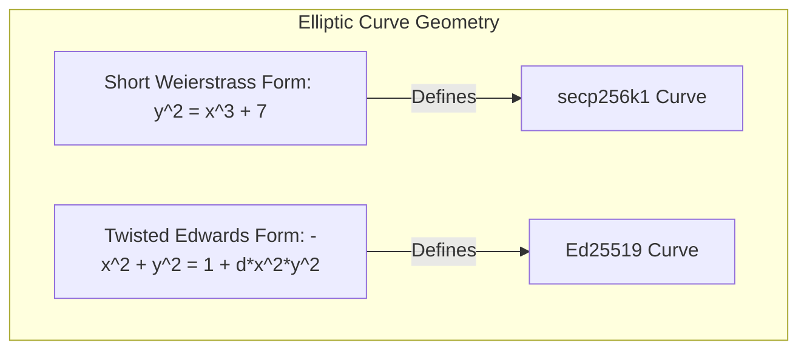

*Last updated: June 18, 2026*

Elliptic Curve Cryptography (ECC) represents a major upgrade over older prime factorization cryptosystems like RSA. By using the geometry of elliptic curves, ECC achieves strong security with key sizes that are a fraction of the size. This translates to faster handshakes, less storage, and lower computational overhead.

However, ECC is not a single algorithm. It consists of multiple curves, each with its own mathematical equation, coordinate representation, and design goals. In the modern technology and blockchain spaces, choosing between **Ed25519 vs secp256k1** is a common design decision for software engineers building security protocols or decentralized applications.

In this guide, we will compare the mathematics, performance, implementation safety, and blockchain integrations of these two dominant curves.

> **Featured Snippet: What is the difference between Ed25519 and secp256k1?**
> The difference between Ed25519 and secp256k1 lies in their curve structure and application. Ed25519 is a twisted Edwards curve optimized for constant-time, misuse-resistant digital signatures in general-purpose security protocols, while secp256k1 is a Koblitz curve in Short Weierstrass form, historically chosen to secure Bitcoin and Ethereum account addresses.

---

## Which Curve Should You Choose?

> **Which Curve Should You Choose?**
> 
> * **Choose Ed25519 if:**
>   * You are building general-purpose security tools (SSH, secure messaging, config files).
>   * You are developing on modern blockchain networks like Solana or Near.
>   * You need constant-time signing execution that is highly resistant to timing side-channels.
> 
> * **Choose secp256k1 if:**
>   * You are building wallet software or decentralized applications (dApps) for Bitcoin, Ethereum, or EVM-compatible networks.
>   * You require compatibility with existing Koblitz curve infrastructure and address recovery systems.

---

## Table of Contents
1. [At-a-Glance Comparison](#at-a-glance-comparison)
2. [What is secp256k1?](#what-is-secp256k1)
3. [What is Ed25519?](#what-is-ed25519)
4. [The Mathematical Equations](#the-mathematical-equations)
5. [Performance & Speed Benchmarks](#performance--speed-benchmarks)
6. [Implementation Safety and Misuse Resistance](#implementation-safety-and-misuse-resistance)
7. [Blockchain Integrations](#blockchain-integrations)
8. [Real-World Recommendation Table](#real-world-recommendation-table)
9. [Migration Considerations](#migration-considerations)
10. [Troubleshooting & Design FAQs](#troubleshooting--design-faqs)
11. [Conclusion](#conclusion)
12. [Further Reading](#further-reading)
13. [About the Author](#about-the-author)
14. [References](#references)

---

## At-a-Glance Comparison

Below is a comparison table summarizing the core parameters of both curves:

| Property | Ed25519 | secp256k1 |
| :--- | :--- | :--- |
| **Equation Form** | Twisted Edwards | Short Weierstrass |
| **Prime Field** | $2^{255} - 19$ | $2^{256} - 2^{32} - 977$ |
| **Symmetric Security** | ~128-bit equivalent | ~128-bit equivalent |
| **Nonce Generation** | Deterministic by default | Originally random (RFC 6979 adds deterministic) |
| **Timing Attacks** | Highly resistant (constant-time) | Requires careful implementation to achieve constant-time behavior |
| **Signature Format** | EdDSA signatures | ECDSA signatures |
| **Primary Ecosystem** | Solana, Near, SSH, Signal, WireGuard | Bitcoin, Ethereum, EVM networks |

---

## What is secp256k1?

The curve secp256k1 belongs to a family of curves defined by the Standards for Efficient Cryptography Group (SECG). It was standardized in 2000, but it remained relatively obscure until 2008 when Satoshi Nakamoto selected it as the cryptographic foundation for Bitcoin.

Satoshi's choice of secp256k1 was unusual at the time. Most commercial applications used the NIST P-256 curve. However, Satoshi avoided the NIST P-256 curve because of concerns that the parameters hid a backdoor. The parameters of secp256k1, in contrast, were chosen in a transparent, deterministic manner, making it highly secure against backdoor vulnerabilities. Since Bitcoin's launch, secp256k1 has been adopted by Ethereum, Litecoin, Dogecoin, and many other early blockchain projects.

---

## What is Ed25519?

Ed25519 was designed in 2011 by a team of cryptographers led by Daniel J. Bernstein. It is the Edwards-curve Digital Signature Algorithm (EdDSA) operating over Curve25519. 

Bernstein's design goal was to address the speed and implementation vulnerabilities of standard ECDSA algorithms. Ed25519 is designed to execute in constant time, operate deterministically without per-signature random number generation, and run extremely fast on 64-bit processors.

Ed25519 has become the default choice for modern operating systems, SSH clients, the Tor network, and secure messaging apps. It is also used in newer high-throughput blockchains like Solana and Near. For an introduction to the basics, see [what is Ed25519](/blog/what-is-ed25519/).

---

## The Mathematical Equations

The primary difference between the two curves is their mathematical structure.



### secp256k1 (Short Weierstrass Form)
The secp256k1 curve is a Koblitz curve defined over a prime field. Its equation uses the Short Weierstrass form:
$$y^2 = x^3 + 7 \pmod p$$

Where $p$ is the large prime number $2^{256} - 2^{32} - 977$.

Koblitz curves possess specific endomorphism properties that allow for faster scalar multiplication. This helps speed up signature verification. However, addition formulas on Weierstrass curves have exceptional points (such as doubling a point or adding the identity point), requiring branching logic in code.

### Ed25519 (Twisted Edwards Form)
Ed25519 is represented as a twisted Edwards curve. Its equation is:
$$-x^2 + y^2 = 1 - \frac{121665}{121666} x^2 y^2 \pmod p$$

Where $p$ is the prime $2^{255} - 19$.

Twisted Edwards curves allow for complete addition formulas. The same mathematical formula works for adding *any* two points on the curve, including doubling a point or adding the point at infinity. This eliminates exceptional cases, simplifying implementation and reducing timing side-channel leaks.

---

## Performance & Speed Benchmarks

Both curves offer a similar security level of roughly 128 bits, but their performance profiles differ:

* **Key Generation:**
  Ed25519 key generation is virtually instantaneous. It requires generating 32 random bytes and performing a single point multiplication. secp256k1 key generation is also fast but takes slightly more CPU cycles due to the Weierstrass coordinates.
* **Signing Speed:**
  Ed25519 is highly optimized for fast signing. The deterministic signing algorithm derives nonces locally without querying system entropy, running faster than standard secp256k1 signing.
* **Verification Speed:**
  Ed25519 verification is extremely fast. However, because secp256k1 is a Koblitz curve, highly optimized implementations (like `libsecp256k1` used in Bitcoin Core) use endomorphisms to speed up point multiplication, allowing secp256k1 verification to perform at similar speeds.

---

## Implementation Safety and Misuse Resistance

Writing secure cryptographic code is extremely difficult. The design of Ed25519 makes it significantly easier to write safely than secp256k1:

### 1. Deterministic Nonces
Standard ECDSA on secp256k1 requires a cryptographically secure random value (nonce) for every signature. If the random number generator fails, leaks entropy, or repeats a single value, an attacker can extract the private key. 

To resolve this on secp256k1, developers must implement RFC 6979 (deterministic ECDSA). Ed25519, on the other hand, has deterministic signing built directly into the core specification. Learn more in our [signing and verification walkthrough](/blog/signing-and-verifying-with-ed25519/).

### 2. Constant-Time Math
Because the addition formulas on Ed25519 are complete, the code does not require conditional branches based on private key values. This ensures that the code runs in constant time, preventing timing side-channel attacks. 

Weierstrass curves like secp256k1 have exceptional mathematical points, meaning it requires careful implementation to achieve constant-time behavior comparable to Ed25519.

### Signing Workflows Comparison

```mermaid
graph TD
    subgraph EdDSA Signing (Ed25519)
        msg1[Message] -->|Hash with Secret Prefix| r1[Deterministic Nonce r]
        r1 -->|r * B| R1[Point R]
        R1 -->|Scalar Math S = r + h * s| sig1[Signature R || S]
    end
    
    subgraph ECDSA Signing (secp256k1)
        msg2[Message] -->|Hash| hash2[Digest]
        hash2 -->|Random Nonce k OR RFC 6979| nonce2[k]
        nonce2 -->|k * B| R2[Point R]
        R2 -->|Scalar Math S = k^-1 * e + r * s| sig2[Signature r, s]
    end
```

---

## Blockchain Integrations

The choice of curve has a major impact on blockchain performance and scalability:

* **Satoshi's Legacy (secp256k1):**
  Bitcoin, Ethereum, and Dogecoin use secp256k1 because it was the most robust, non-NIST curve available in 2008. Changing the core curve on these networks requires a hard fork, meaning they will continue using secp256k1 for the foreseeable future.
* **The High-Throughput Wave (Ed25519):**
  Solana, Near, and Ripple use Ed25519. Because these networks process thousands of transactions per second, they require the constant-time execution and low coordinate overhead of Ed25519 to handle high parallel verification loads.
* **Cardano Support:**
  Cardano uses Ed25519 extensively but implements specific variants such as **Ed25519-BIP32** to support hierarchical deterministic (HD) wallet generation.
* **Signal Support:**
  The Signal messaging protocol uses Curve25519 (via X25519) extensively for key agreement (Diffie-Hellman) and utilizes Ed25519 in specific parts of its identity verification ecosystem, rather than relying on Ed25519 as its sole primitive.

---

## Real-World Recommendation Table

Use the guide below to choose the correct curve for your target deployment:

| Use Case | Recommended Curve | Rationale |
| :--- | :--- | :--- |
| **SSH Authentication** | **Ed25519** | Standard default for modern SSH clients. |
| **GitHub SSH Keys** | **Ed25519** | Fully supported and recommended by GitHub. |
| **Bitcoin Wallets** | **secp256k1** | Required by the Bitcoin protocol. |
| **Ethereum Wallets** | **secp256k1** | Required by the Ethereum EVM client standard. |
| **Solana Development** | **Ed25519** | Default key standard for Solana addresses. |
| **Secure Messaging** | **Ed25519** | Used for identity keys in Signal family protocols. |
| **New Applications** | **Ed25519** | Safer implementation margin and constant-time math. |

---

## Migration Considerations

If you are evaluating whether to migrate your system from secp256k1 to Ed25519, consider the following constraints:

* **Ecosystem Compatibility:**
  If your application must interface with existing Ethereum smart contracts or Bitcoin transaction builders, you must use secp256k1. Smart contracts rely on the `ecrecover` precompiled contract, which is locked to secp256k1 ECDSA signatures.
* **Interoperability:**
  If you are building a cross-chain bridge or multi-signature wallet, your system must support both curves. Wallets like Ledger and Trezor support both, allowing developers to manage keys on both paths.
* **New Projects vs. Legacy Systems:**
  For new non-blockchain projects, choose Ed25519. It avoids the math exceptions of Weierstrass curves and guarantees constant-time operations, protecting your systems from side-channel timing attacks.

---

## Troubleshooting & Design FAQs

### Q1: Is Ed25519 better than secp256k1?
For general-purpose applications and high-throughput systems, yes. Ed25519 is safer to implement, executes natively in constant time, and has deterministic signing built into the core specification.

### Q2: Why did Bitcoin choose secp256k1 instead of Ed25519?
Bitcoin was created in 2008, while Ed25519 was not designed until 2011. Satoshi Nakamoto selected secp256k1 because it was the most secure, non-NIST alternative available at the time.

### Q3: Why didn't Satoshi use standard NIST curves?
Satoshi avoided standard NIST curves (like P-256) because of concerns that the parameters had been selected by the NSA in a way that hid a backdoor, a concern later validated by security researchers.

### Q4: Can Ethereum migrate to Ed25519?
A complete migration of the EVM to Ed25519 is unlikely because it would break compatibility with all existing addresses and smart contracts. However, the Ethereum consensus layer uses different curves (specifically BLS12-381) for validator handshakes, showing that modern updates can adopt different algorithms.

### Q5: Can I convert secp256k1 keys to Ed25519?
No. Because they are based on different mathematical equations (twisted Edwards vs Weierstrass) and operate on different prime fields, you cannot convert keys between them. You must generate a new key pair for each curve.

### Q6: Which curve is faster?
Ed25519 is generally faster for signing. However, because secp256k1 is a Koblitz curve, highly optimized libraries (like `libsecp256k1`) use endomorphisms to perform point multiplication quickly, making verification speeds comparable.

### Q7: Is secp256k1 obsolete?
No. Because it secures the entire Bitcoin and Ethereum ecosystems, secp256k1 remains one of the most widely used and audited curves in the world. It is highly secure when implemented using constant-time libraries like `libsecp256k1`.

### Q8: Is Ed25519 quantum resistant?
No. Like all standard elliptic curves and RSA, Ed25519 is vulnerable to sufficiently capable quantum computers running Shor's algorithm. For quantum resistance, developers must transition to post-quantum signature standards.

---

## Conclusion

Both Ed25519 and secp256k1 are exceptionally secure curves when implemented correctly. For general-purpose application development, modern SSH access, and high-throughput blockchain networks, **Ed25519** is the superior choice due to its constant-time safety margins. Keep **secp256k1** exclusively for projects that must interface with the Bitcoin and Ethereum ecosystems.

---

## Further Reading
* [What is Ed25519?](/blog/what-is-ed25519/)
* [Ed25519 vs RSA](/blog/ed25519-vs-rsa/)
* [X25519 vs Ed25519: What is the Difference?](/blog/x25519-vs-ed25519/)
* [Digital Signature vs Encryption](/blog/digital-signature-vs-encryption/)
* [Signing and Verifying with Ed25519](/blog/signing-and-verifying-with-ed25519/)

---

## About the Author

**Written by Zeeshan Tariq**

Software engineer focused on cryptography, authentication systems, and full-stack development. Zeeshan has designed secure authentication integrations for enterprise cloud systems and regularly audits cryptographic configurations.

---

## References
1. Standards for Efficient Cryptography Group. (2010). *SEC 2: Recommended Elliptic Curve Domain Parameters*. Version 2.0. [https://www.secg.org/sec2-v2.pdf](https://www.secg.org/sec2-v2.pdf)
2. Bernstein, D. J., Duif, N., Lange, T., Schwab, P.-Y., & Yang, B.-Y. (2012). *High-speed high-security signatures*. Journal of Cryptographic Engineering, 2(2), 77-89. [https://ed25519.cr.yp.to/ed25519-20110926.pdf](https://ed25519.cr.yp.to/ed25519-20110926.pdf)
3. ecdsa development team. (2020). *ECDSA: Elliptic Curve Digital Signature Algorithm in Python*. [https://github.com/tlsfuzzer/python-ecdsa](https://github.com/tlsfuzzer/python-ecdsa)
4. Pornin, T. (2013). *Deterministic Usage of the Digital Signature Algorithm (DSA) and Elliptic Curve Digital Signature Algorithm (ECDSA)*. RFC 6979. IETF. [https://tools.ietf.org/html/rfc6979](https://tools.ietf.org/html/rfc6979)

<script type="application/ld+json">
{
  "@context": "https://schema.org",
  "@type": "Article",
  "headline": "Ed25519 vs secp256k1: Which Elliptic Curve Is Better?",
  "description": "Compare the Ed25519 and secp256k1 elliptic curves, their mathematical equations, safety features, performance, and use in blockchain networks.",
  "author": {
    "@type": "Person",
    "name": "Zeeshan Tariq"
  },
  "datePublished": "2026-06-18",
  "dateModified": "2026-06-18"
}
</script>

<script type="application/ld+json">
{
  "@context": "https://schema.org",
  "@type": "FAQPage",
  "mainEntity": [
    {
      "@type": "Question",
      "name": "Is Ed25519 better than secp256k1?",
      "acceptedAnswer": {
        "@type": "Answer",
        "text": "For general-purpose applications, yes. Ed25519 is safer to implement, executes in constant time, and has deterministic signing built into the core specification."
      }
    },
    {
      "@type": "Question",
      "name": "Why did Bitcoin choose secp256k1?",
      "acceptedAnswer": {
        "@type": "Answer",
        "text": "Bitcoin was created in 2008, while Ed25519 was not designed until 2011. secp256k1 was the most secure, non-NIST curve available at the time."
      }
    },
    {
      "@type": "Question",
      "name": "Can I convert secp256k1 keys to Ed25519?",
      "acceptedAnswer": {
        "@type": "Answer",
        "text": "No. Because they operate on different prime fields and use different mathematical curve equations, you cannot convert keys between them."
      }
    },
    {
      "@type": "Question",
      "name": "Which curve is faster?",
      "acceptedAnswer": {
        "@type": "Answer",
        "text": "Ed25519 is generally faster for signing. However, secp256k1 uses endomorphisms to perform point multiplication quickly, making verification speeds comparable."
      }
    },
    {
      "@type": "Question",
      "name": "Which curve is safer?",
      "acceptedAnswer": {
        "@type": "Answer",
        "text": "Ed25519 is safer because it natively guarantees constant-time execution and deterministic signatures, protecting against timing and RNG exploits."
      }
    }
  ]
}
</script>
