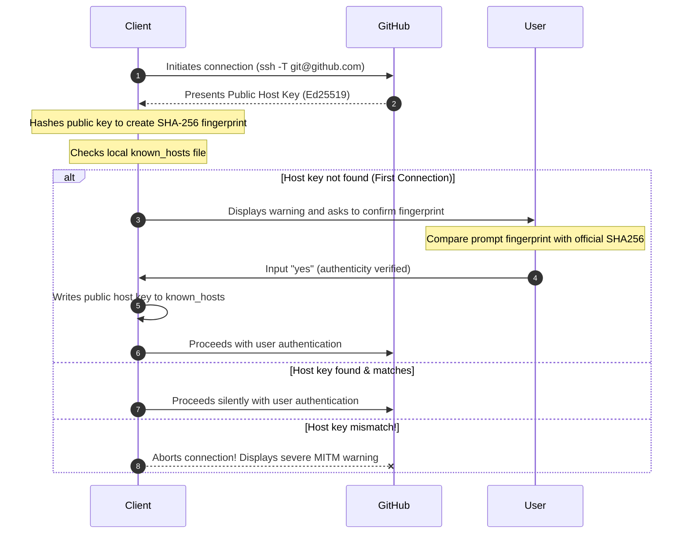
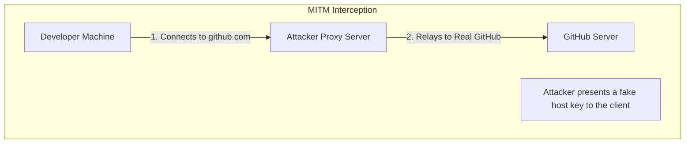

*Last updated: June 18, 2026*

When connecting to GitHub over Secure Shell (SSH), verifying the **GitHub SSH host key** is a vital security step. The very first time you clone a repository or run a connection test, your terminal displays a **GitHub SSH fingerprint**, most importantly the modern **GitHub Ed25519 fingerprint**. This warning is part of the Secure Shell (SSH) security protocol. It prevents unauthorized interception of your data. This complete guide shows you how to check the host key, prevent attacks, and configure client settings.

> **Featured Snippet: What is GitHub's SSH fingerprint?**
> GitHub's current Ed25519 SSH host key fingerprint is:
> `SHA256:+DiY3wvvV6TuJJhbpZisF/zLDA0zPMSvHdkr4UvCOqU`
> 
> Verify it against GitHub's official documentation before accepting a new SSH connection.

---

## Quick Verification

Many visitors simply want to verify the fingerprint quickly. To fetch the presented host key and show the **SSH fingerprint GitHub** provides, run this command in your terminal:

```bash
ssh-keyscan github.com | ssh-keygen -lf -
```

> [strong]IMPORTANT[/strong]
> Running `ssh-keyscan` alone does not independently verify server authenticity. Because it retrieves the key over the same network connection you are trying to trust, a man-in-the-middle attacker could intercept this request and return a fake key. You must compare the resulting fingerprint with GitHub's officially published value to ensure a secure connection.

---

## Table of Contents
1. [GitHub's Official SSH Host Key Fingerprints](#githubs-official-ssh-host-key-fingerprints)
2. [What is an SSH Host Key and Fingerprint?](#what-is-an-ssh-host-key-and-fingerprint)
3. [Why Am I Seeing This Fingerprint Prompt?](#why-am-i-seeing-this-fingerprint-prompt)
4. [Where is the GitHub known_hosts File Stored?](#where-is-the-github-known_hosts-file-stored)
5. [How to Verify GitHub's Fingerprint Yourself](#how-to-verify-githubs-fingerprint-yourself)
6. [Windows Setup and Verification Instructions](#windows-setup-and-verification-instructions)
7. [The Anatomy of a Man-in-the-Middle (MITM) Attack](#the-anatomy-of-a-man-in-the-middle-mitm-attack)
8. [Chronology: The 2023 GitHub RSA Host Key Rotation](#chronology-the-2023-github-rsa-host-key-rotation)
9. [Advanced Verification: DNSSEC and SSHFP Records](#advanced-verification-dnssec-and-sshfp-records)
10. [Troubleshooting Common SSH Fingerprint Errors](#troubleshooting-common-ssh-fingerprint-errors)
11. [Frequently Asked Questions (FAQs)](#frequently-asked-questions-faqs)
12. [Conclusion](#conclusion)
13. [About the Author](#about-the-author)
14. [References](#references)

---

## GitHub's Official SSH Host Key Fingerprints

Below are the official, published fingerprints for the **GitHub SSH host key**. The Ed25519 key is the modern, recommended standard used by default in modern SSH configurations.

| Key Algorithm | SHA256 Fingerprint (Base64 Representation) | Key Length and Type |
| :--- | :--- | :--- |
| **Ed25519** | `SHA256:+DiY3wvvV6TuJJhbpZisF/zLDA0zPMSvHdkr4UvCOqU` | 256-bit Twisted Edwards Curve |
| **ECDSA** | `SHA256:p2QAMXNIC1TJYWeIOttrVc98/R1BUFWu3/LiyKgUfQM` | 256-bit NIST P-256 Curve |
| **RSA** | `SHA256:uNiVztksCsDhcc0u9e8BujQXVUpKZIDTMczCvj3tD2s` | 3072-bit Integer Factorization |

---

## What is an SSH Host Key and Fingerprint?

To secure remote connections, we must understand the cryptographic roles of host keys and fingerprints.

### What is an SSH host key?
> **Featured Snippet: What is an SSH host key?**
> An SSH host key is a cryptographic key pair stored on an SSH server. The server keeps the private key secure and sends the public key to connecting clients, allowing them to verify the server's identity.

### What is an SSH fingerprint?
> **Featured Snippet: What is an SSH fingerprint?**
> An SSH fingerprint is a short, readable hash of the server's public host key (typically encoded using SHA-256 and Base64). It allows users to manually verify that the key matches the official server signature.

### What is TOFU (Trust On First Use)?
> **Featured Snippet: What is TOFU?**
> Trust On First Use (TOFU) is an SSH security model. Because SSH lacks a centralized Certificate Authority system, the client trusts the server's host key the first time it connects and saves it locally. Subsequent connections check against this saved key.

The following diagram illustrates the SSH host key verification workflow on a first connection:



---

## Why Am I Seeing This Fingerprint Prompt?

When you run a command like `ssh -T git@github.com` or attempt to clone a repository for the first time, your SSH client checks your local database. If it does not find an existing entry for `github.com`, it halts the connection. This safety feature ensures that you do not send your authentication credentials to an untrusted machine.

### Is it safe to type "yes"?
It is safe to type `yes` and press Enter **only if** the fingerprint displayed in your terminal matches one of GitHub's official fingerprints listed above. If the fingerprint does not match, type `no`, abort the connection, and audit your network.

Here is what a safe first-time connection prompt looks like:

```text
The authenticity of host 'github.com (140.82.121.4)' can't be established.
ED25519 key fingerprint is SHA256:+DiY3wvvV6TuJJhbpZisF/zLDA0zPMSvHdkr4UvCOqU.
This key is not known by any other names.
Are you sure you want to continue connecting (yes/no/[fingerprint])?
```

Once you type `yes`, the terminal displays:

```text
Warning: Permanently added 'github.com' (ED25519) to the list of known hosts.
Hi username! You've successfully authenticated, but GitHub does not provide shell access.
```

### What if the fingerprint changes?
> **Featured Snippet: What happens if the fingerprint changes?**
> If a server's fingerprint changes, your client blocks the connection and displays a warning. This happens if the server rotated its keys due to a leak, or if an attacker is attempting a man-in-the-middle attack.

If GitHub rotates its keys (as occurred during the 2023 RSA key replacement), you must manually update your configuration. For details on how key changes affect you, read the [2023 GitHub RSA rotation chronology](#chronology-the-2023-github-rsa-host-key-rotation).

---

## Where is the GitHub known_hosts File Stored?

When you accept a **GitHub host key fingerprint**, your SSH client saves the public key in a file named `known_hosts` to complete the **GitHub SSH verification** process. The location of this file depends on your operating system:

* **Linux:** `~/.ssh/known_hosts` (expanded to `/home/username/.ssh/known_hosts`)
* **macOS:** `~/.ssh/known_hosts` (expanded to `/Users/username/.ssh/known_hosts`)
* **Windows OpenSSH:** `%USERPROFILE%\.ssh\known_hosts` (expanded to `C:\Users\username\.ssh\known_hosts`)
* **Git Bash (Windows):** `/c/Users/username/.ssh/known_hosts`

> [!NOTE]
> **GitHub Desktop Note:** The GitHub Desktop client manages SSH credentials internally through Git configurations and desktop wrappers. Most desktop-only users will not see command-line host key verification prompts. This prompt primarily appears when running command-line Git or SSH tools.

---

## How to Verify GitHub's Fingerprint Yourself

To perform a secure **verify GitHub SSH fingerprint** audit, you can check your configuration locally or simulate connection attempts.

### Method 1: Testing Connection and Cloning
To test your connection using the SSH test command, run:

```bash
ssh -T git@github.com
```

To verify the fingerprint during a project download, run:

```bash
git clone git@github.com:user/repository.git
```

Both commands prompt you with the host key fingerprint if `github.com` is not already present in your `known_hosts` file.

### Method 2: Verifying Existing Keys in your known_hosts
If you have already connected to GitHub and want to check if the stored public key matches the official fingerprint, run the following command on Linux or macOS:

```bash
ssh-keygen -lf ~/.ssh/known_hosts -F github.com
```

This command queries the local **GitHub known_hosts** database and outputs the fingerprint of the saved host key:

```text
# Host github.com found: line 1
256 SHA256:+DiY3wvvV6TuJJhbpZisF/zLDA0zPMSvHdkr4UvCOqU github.com (ED25519)
```

---

## Windows Setup and Verification Instructions

If you are developing on Windows, you can verify fingerprints using the built-in Windows OpenSSH client, PowerShell, or Git Bash.

### Windows OpenSSH and PowerShell
Modern Windows 10 and 11 versions include OpenSSH. Open **Windows Terminal** or **PowerShell** and run:

```powershell
# Query the active host key using Windows OpenSSH
ssh-keyscan github.com | ssh-keygen -lf -
```

To locate or inspect the host key storage path in PowerShell, run:

```powershell
Get-Content "$env:USERPROFILE\.ssh\known_hosts"
```

### Git Bash
If you prefer Git Bash (which uses a Unix-like emulation layer), use the standard path format:

```bash
# Verify the stored key within Git Bash
ssh-keygen -lf /c/Users/$USER/.ssh/known_hosts -F github.com
```

---

## The Anatomy of a Man-in-the-Middle (MITM) Attack

The primary reason to verify host fingerprints is to protect your development environment from a **Man-in-the-Middle (MITM)** attack.

In a MITM scenario, an attacker intercepts your network requests (for example, on an unsecured public Wi-Fi network). Instead of connecting you to the real GitHub server, they route your connection to an intermediate server under their control.



If you accept the attacker's host key:
1. The attacker can impersonate the server and establish separate encrypted sessions, enabling interception and modification of traffic.
2. They can capture your personal authentication credentials or inject malicious code into your repositories during a clone or pull operation.

By checking the **GitHub SSH key fingerprint** before accepting the connection, you prevent the initial connection to the attacker's proxy, keeping your codebase secure.

---

## Chronology: The 2023 GitHub RSA Host Key Rotation

Although fingerprint changes are rare, they do occur. On **March 24, 2023**, GitHub rotated its RSA host key unexpectedly.

### What Happened?
GitHub discovered that its private RSA SSH host key was briefly exposed in a public repository. Although there was no evidence that the key was captured or exploited, GitHub immediately revoked and replaced it to protect users.

### The Consequences for Users
Because the RSA private key changed, developers worldwide saw a severe warning when running commands like `git pull` or `git push`:

```text
@@@@@@@@@@@@@@@@@@@@@@@@@@@@@@@@@@@@@@@@@@@@@@@@@@@@@@@@@@@
@    WARNING: REMOTE HOST IDENTIFICATION HAS CHANGED!     @
@@@@@@@@@@@@@@@@@@@@@@@@@@@@@@@@@@@@@@@@@@@@@@@@@@@@@@@@@@@
IT IS POSSIBLE THAT SOMEONE IS DOING SOMETHING NASTY!
```

To fix this, users had to remove the old RSA key from their `known_hosts` file using:

```bash
ssh-keygen -R github.com
```

Once removed, the client prompted users to accept the new RSA fingerprint: `SHA256:uNiVztksCsDhcc0u9e8BujQXVUpKZIDTMczCvj3tD2s`.

### Why Ed25519 Users Were Unaffected
This incident only affected the RSA key. GitHub's Ed25519 private host key was stored in a separate, secure environment and remained uncompromised. Developers who configured their clients to prefer modern **github.com SSH fingerprint** types experienced no downtime, illustrating the stability of the Ed25519 standard.

---

## Advanced Verification: DNSSEC and SSHFP Records

For large deployments or automated server scripting, manual verification does not scale. SSH supports automatic host key verification using **SSHFP (SSH Fingerprint) resource records** in the Domain Name System (DNS).

### How SSHFP Works
A domain owner publishes their SSH fingerprints in their DNS configuration using SSHFP records, which are secured using **DNSSEC** (DNS Security Extensions) to prevent spoofing.

You can view GitHub's SSHFP records using the `dig` utility:

```bash
dig github.com SSHFP
```

### Configuring SSH to Verify via DNS
To configure your SSH client to automatically trust host keys that match DNSSEC-verified SSHFP records, add this configuration block to your `~/.ssh/config` file:

```text
Host github.com
    VerifyHostKeyDNS yes
```

> [!WARNING]
> Many client systems, enterprise DNS resolvers, and home routers do not validate DNSSEC signatures. If your local resolver does not validate DNSSEC, the `VerifyHostKeyDNS` option will fail back to manual verification. Do not rely on SSHFP as a single point of validation on untrusted networks.

---

## Troubleshooting Common SSH Fingerprint Errors

When configuring your **GitHub SSH key fingerprint** settings, you may encounter the following common errors:

### 1. Host key verification failed
* **Cause:** The host key sent by the server does not match the key stored in your `known_hosts` file, or you typed `no` when prompted.
* **Solution:** Verify the fingerprint. If the server rotated its key, remove the outdated entry using `ssh-keygen -R github.com` and reconnect.

### 2. Permission denied (publickey)
* **Cause:** The server accepted the host key, but rejected your personal client authentication key.
* **Solution:** Verify that your public key is added to your GitHub settings. For step-by-step help, check our [SSH key troubleshooting guide](/blog/common-ed25519-errors-and-solutions/).

### 3. No matching host key type
* **Cause:** Your SSH client is configured to require an algorithm (like Ed25519) that the server does not support, or vice-versa.
* **Solution:** Update your client to support modern algorithms. Ensure your `~/.ssh/config` file does not exclude `ssh-ed25519`.

### 4. Could not resolve hostname github.com
* **Cause:** Your local system cannot resolve the IP address of GitHub due to a network connection failure or a DNS issue.
* **Solution:** Check your internet connection or verify your DNS server configuration.

---

## Frequently Asked Questions (FAQs)

### Q1: Is GitHub's Ed25519 fingerprint safe?
Yes. The Ed25519 fingerprint `SHA256:+DiY3wvvV6TuJJhbpZisF/zLDA0zPMSvHdkr4UvCOqU` is GitHub's official cryptographic identifier. It is safer than RSA because it uses modern, constant-time algorithms that resist timing side-channel exploits.

### Q2: Why did GitHub change its RSA fingerprint?
GitHub changed its RSA fingerprint in March 2023 because its private RSA host key was briefly exposed in a public repository. The key was rotated to prevent potential decryption or impersonation attacks.

### Q3: Does GitHub still use RSA?
Yes, GitHub still supports RSA host keys (using the 3072-bit standard) to maintain compatibility with legacy SSH clients. However, modern clients default to Ed25519.

### Q4: Can GitHub's fingerprint change again?
Yes, but only in response to a key compromise or a major security update. In normal operations, host keys are long-term credentials that remain unchanged for years.

### Q5: Should I delete my known_hosts file?
No. Deleting your entire `known_hosts` file removes verified keys for all other servers you connect to, forcing you to manually re-verify every host. Instead, remove specific outdated lines using `ssh-keygen -R hostname`.

### Q6: What is a known_hosts file?
The `known_hosts` file is a local database used by your SSH client to store the verified public keys of remote servers you have connected to. It is used to verify the server's identity on subsequent connections.

### Q7: Can I verify fingerprints without SSH?
Yes. You can cross-check fingerprints by visiting GitHub's official documentation over HTTPS or by inspecting GitHub's API endpoints using a browser or an HTTPS utility like `curl`.

---

## Conclusion

Securing your Git workflows requires verified cryptographic connections. To protect your development environment:
* **Always verify unknown host fingerprints:** Do not type `yes` without comparing the terminal fingerprint to GitHub's official keys.
* **Prefer Ed25519:** Set up your client to prioritize the modern Ed25519 standard. Read our [Ed25519 SSH key guide](/blog/id_ed25519/) to configure it.
* **Never ignore host mismatch warnings:** A changed key warning can indicate a man-in-the-middle exploit.
* **Cross-check with GitHub Docs:** When in doubt, verify keys against official documentation over a secure HTTPS connection.

For details on upgrading your SSH configurations, see our guides on [what is Ed25519](/blog/what-is-ed25519/) or comparing [Ed25519 vs RSA](/blog/ed25519-vs-rsa/).

---

## About the Author

**Written by Zeeshan Tariq**

Software engineer focused on cryptography, authentication systems, and full-stack development. Zeeshan has designed secure authentication integrations for enterprise cloud systems and regularly audits cryptographic configurations.

---

## References
1. GitHub Inc. (2023). *GitHub's SSH key fingerprints*. GitHub Docs. [https://docs.github.com/en/authentication/keeping-your-account-and-data-secure/githubs-ssh-key-fingerprints](https://docs.github.com/en/authentication/keeping-your-account-and-data-secure/githubs-ssh-key-fingerprints)
2. GitHub Inc. (2023). *We updated our RSA SSH host key*. GitHub Engineering Blog. [https://github.blog/2023-03-24-we-updated-our-rsa-ssh-host-key/](https://github.blog/2023-03-24-we-updated-our-rsa-ssh-host-key/)
3. Ylonen, T., & Lonvick, C. (2006). *The Secure Shell (SSH) Protocol Architecture*. RFC 4251. IETF. [https://tools.ietf.org/html/rfc4251](https://tools.ietf.org/html/rfc4251)
4. Griffin, D. (2005). *Using DNS to Securely Publish Secure Shell (SSH) Key Fingerprints*. RFC 4255. IETF. [https://tools.ietf.org/html/rfc4255](https://tools.ietf.org/html/rfc4255)

<script type="application/ld+json">
{
  "@context": "https://schema.org",
  "@type": "Article",
  "headline": "GitHub Ed25519 SSH Host Key Fingerprint: Complete Verification Guide",
  "description": "A complete guide to verifying GitHub's Ed25519 SSH host key fingerprint. Learn how to secure your SSH connection, troubleshoot fingerprint warnings, and configure SSH.",
  "author": {
    "@type": "Person",
    "name": "Zeeshan Tariq"
  },
  "datePublished": "2026-06-02",
  "dateModified": "2026-06-18"
}
</script>

<script type="application/ld+json">
{
  "@context": "https://schema.org",
  "@type": "FAQPage",
  "mainEntity": [
    {
      "@type": "Question",
      "name": "Is GitHub's Ed25519 fingerprint safe?",
      "acceptedAnswer": {
        "@type": "Answer",
        "text": "Yes. The Ed25519 fingerprint SHA256:+DiY3wvvV6TuJJhbpZisF/zLDA0zPMSvHdkr4UvCOqU is GitHub's official cryptographic identifier."
      }
    },
    {
      "@type": "Question",
      "name": "Why did GitHub change its RSA fingerprint?",
      "acceptedAnswer": {
        "@type": "Answer",
        "text": "GitHub changed its RSA fingerprint in March 2023 because its private RSA host key was briefly exposed in a public repository."
      }
    },
    {
      "@type": "Question",
      "name": "Does GitHub still use RSA?",
      "acceptedAnswer": {
        "@type": "Answer",
        "text": "Yes, GitHub still supports RSA host keys (3072-bit standard) for legacy compatibility, though modern clients default to Ed25519."
      }
    },
    {
      "@type": "Question",
      "name": "Can GitHub's fingerprint change again?",
      "acceptedAnswer": {
        "@type": "Answer",
        "text": "Yes, but only in response to a key compromise or major security update. Normally, host keys remain unchanged for years."
      }
    },
    {
      "@type": "Question",
      "name": "Should I delete my known_hosts file?",
      "acceptedAnswer": {
        "@type": "Answer",
        "text": "No. Deleting the file removes all verified keys, forcing manual verification for every host. Instead, remove the specific outdated line using ssh-keygen -R github.com."
      }
    }
  ]
}
</script>

<script type="application/ld+json">
{
  "@context": "https://schema.org",
  "@type": "BreadcrumbList",
  "itemListElement": [
    {
      "@type": "ListItem",
      "position": 1,
      "name": "Blog",
      "item": "https://ed25519.com/blog/"
    },
    {
      "@type": "ListItem",
      "position": 2,
      "name": "GitHub Ed25519 SSH Host Key Fingerprint",
      "item": "https://ed25519.com/blog/github-ssh-host-key-fingerprint-ed25519/"
    }
  ]
}
</script>
