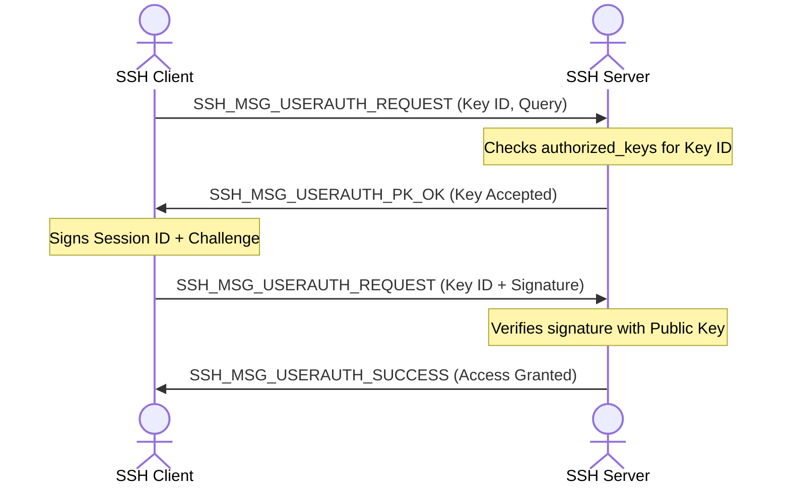

*Last updated: June 18, 2026*

Secure Shell (SSH) is the industry standard protocol for managing remote servers and network appliances. While SSH supports password logins, security guidelines recommend using public key authentication. 

> **Featured Snippet: How does SSH key authentication work?**
> SSH key authentication works using a public key challenge-response protocol. The server encrypts a challenge value (or signs a session identifier) using the client's registered public key. The client proves possession of the matching private key by decrypting or signing the challenge and returning the proof.


From a user perspective, key authentication feels simple. You run `ssh user@host`, and the terminal opens. However, in the background, your client and the server execute a complex cryptographic handshake. They negotiate encryption algorithms, verify the server's identity, establish shared session keys, and perform a challenge-response verification sequence.

In this guide, we will trace the entire SSH connection lifecycle step-by-step, explain the math behind the challenge-response sequence, and show you how to audit this process using verbose connection logs.

---

## Table of Contents
1. [The SSH Protocol Architecture](#the-ssh-protocol-architecture)
2. [Passwords vs. Public Keys: A Security Comparison](#passwords-vs-public-keys-a-security-comparison)
3. [Step 1: Protocol Negotiation](#step-1-protocol-negotiation)
4. [Step 2: Host Key Verification (Identity Check)](#step-2-host-key-verification-identity-check)
5. [Step 3: Diffie-Hellman Key Exchange](#step-3-diffie-hellman-key-exchange)
6. [Step 4: The Authentication Challenge-Response Sequence](#step-4-the-authentication-challenge-response-sequence)
7. [At-a-Glance Handshake Summary Table](#at-a-glance-handshake-summary-table)
8. [Auditing the Handshake: Using Verbose Mode](#auditing-the-handshake-using-verbose-mode)
9. [Frequently Asked Questions (FAQs)](#frequently-asked-questions-faqs)
10. [About the Author](#about-the-author)
11. [References](#references)

---

## The SSH Protocol Architecture

The SSH protocol is divided into three distinct layers, as defined in RFC 4251:

1. **The Transport Layer Protocol (SSH-TRANS):**
   Handles the initial connection, server authentication, and establishes a secure, encrypted channel.
2. **The User Authentication Protocol (SSH-USERAUTH):**
   Authenticates the client to the server (using passwords, public keys, or host based authentication).
3. **The Connection Protocol (SSH-CONN):**
   Multiplexes the secure tunnel into multiple logical channels (shell sessions, port forwarding, SFTP transfers).

---

## Passwords vs. Public Keys: A Security Comparison

Using passwords over SSH introduces several security vulnerabilities:
* **Brute-Force Attacks:** Attackers use automated scripts to try thousands of common passwords against your port 22, eventually guessing weak passwords.
* **Credential Stuffing:** If your password leaks from another website breach, attackers use it to access your servers.
* **Password Sniffing:** If a client's computer is compromised, keyloggers can capture the typed password.

Public key authentication solves these issues:
* **Brute-Force Immunity:** An Ed25519 private key is a 256-bit scalar, which is impossible to guess by brute force.
* **No Shared Secrets:** The private key never leaves your local computer. Even if the remote server is compromised, the attacker only obtains your public key, which cannot be used to log into other systems.
* **Resistance to Interception:** Authentication relies on digital signatures over temporary session challenges. Intercepting the challenge does not allow an attacker to log in later.

Learn more about key types in our [RSA vs Ed25519 SSH keys guide](/blog/rsa-vs-ed25519-ssh-keys/).

---

## Step 1: Protocol Negotiation

When you initiate a connection, the client and server exchange text banners indicating their protocol version (e.g., `SSH-2.0-OpenSSH_9.6`).

Next, they send list packets called `SSH_MSG_KEXINIT`. These packets contain the lists of cryptographic algorithms supported by each side:
* **Key Exchange (KEX) Algorithms:** (e.g., `curve25519-sha256`, `diffie-hellman-group14-sha256`).
* **Host Key Algorithms:** (e.g., `ssh-ed25519`, `rsa-sha2-512`).
* **Encryption Ciphers:** (e.g., `aes256-gcm@openssh.com`, `chacha20-poly1305@openssh.com`).
* **MAC Algorithms:** Used for data integrity on older ciphers (e.g., `hmac-sha2-512`).

The client and server select the first algorithm in the client's list that is also supported by the server.

---

## Step 2: Host Key Verification (Identity Check)

Before encrypting data, the client must verify that it is talking to the correct server, preventing Man-in-the-Middle (MITM) attacks.

The server sends its public **host key** to the client. 
* If this is your first connection, the client prompts you to verify the key's fingerprint.
* If you have connected before, the client compares the host key to the entry stored in your local `known_hosts` file. If they match, the handshake continues.

For details on this verification process, check out our [GitHub host key fingerprint guide](/blog/github-ssh-host-key-fingerprint-ed25519/).

---

## Step 3: Diffie-Hellman Key Exchange

Next, the client and server perform an ephemeral key exchange (usually **X25519** or standard Elliptic Curve Diffie-Hellman). 

1. The client generates a temporary key pair.
2. The server generates a temporary key pair.
3. They exchange their public halves.
4. Both compute the same shared secret, which is used to derive the symmetric encryption keys for this specific session.

At this stage, the Transport Layer encryption is active. All subsequent packets are encrypted using fast symmetric ciphers. The attacker can no longer read the contents of the handshake.

---

## Step 4: The Authentication Challenge-Response Sequence

Now that the encrypted channel is established, the client initiates the User Authentication protocol.



1. **The Query:** The client sends an `SSH_MSG_USERAUTH_REQUEST` message. This message contains the client's username, the authentication method (`publickey`), the key algorithm (e.g., `ssh-ed25519`), and the public key data.
2. **The Lookup:** The server opens the target user's `~/.ssh/authorized_keys` file. It searches for a matching public key line.
   * If the key is not found, the server rejects the request.
   * If the key matches, the server replies with `SSH_MSG_USERAUTH_PK_OK`, indicating that the key is authorized.
3. **The Challenge:** To prove ownership of the matching private key, the client generates a digital signature. The client concatenates the unique **Session Identifier** (derived during the key exchange step) along with the username, service name, and public key data.
4. **The Signature:** The client signs this combined data block using its local private key (e.g., `id_ed25519`) and sends it to the server.
5. **The Verification:** The server receives the signature, reconstructs the same data block, and verifies the signature using the client's public key.
   * If the signature is mathematically valid, the server replies with `SSH_MSG_USERAUTH_SUCCESS` and opens a shell session.

---

## At-a-Glance Handshake Summary Table

| Phase | Action | Purpose | Primary Cryptography |
| :--- | :--- | :--- | :--- |
| **Negotiation** | Exchanges algorithm lists | Agrees on protocol parameters | None |
| **Host Check** | Verifies server's host key | Prevents MITM attacks | Ed25519 or RSA Host Key |
| **KEX Exchange** | Computes shared secret | Establishes encrypted channel | X25519 or ECDH |
| **Authentication** | Challenge response handshake | Authenticates client identity | Client Private Key Signing |

---

## Auditing the Handshake: Using Verbose Mode

You can inspect the entire handshake process in real time by running the `ssh` command with the `-v` (verbose) flag:

```bash
ssh -v user@server.com
```

Look for these critical log milestones:
* **Algorithm Negotiation:**
  `debug1: kex: algorithm: curve25519-sha256`
  `debug1: kex: host key algorithm: ssh-ed25519`
* **Host Key Check:**
  `debug1: Host 'server.com' is known and matches the ED25519 host key.`
* **Offering Public Key:**
  `debug1: Offering public key: /home/user/.ssh/id_ed25519 ED25519 SHA256:...`
* **Successful Authentication:**
  `debug1: Server accepts key: /home/user/.ssh/id_ed25519 ED25519 SHA256:...`
  `debug1: Authentication succeeded (publickey).`

---

## Frequently Asked Questions (FAQs)

### Q1: Does the SSH server store a copy of my private key?
No. The server only stores your public key in the `authorized_keys` file. During login, the server sends a challenge, and your local client uses your private key to sign the challenge, sending only the signature back. Your private key never leaves your local machine.

### Q2: What is the purpose of the Session Identifier in the challenge?
The Session Identifier is a unique cryptographic value derived during the key exchange. Including it in the signed challenge ensures that the signature is only valid for this specific active connection, preventing reply attacks where an attacker captures your signature and attempts to reuse it in a separate connection.

### Q3: How do I manage multiple SSH keys?
You can use the SSH agent to hold your keys in memory. You can also configure specific keys for different servers in your local configuration file `~/.ssh/config` using the `IdentityFile` option. For details, read our [how-to-add-ssh-key-to-github guide](/blog/how-to-add-ssh-key-to-github/).

### Q4: Why does SSH fail with "agent refused key" or "Permission denied"?
This usually happens if the server's permissions are misconfigured, or if the server does not support the offered key type. You can run `ssh -v` to check the debugging logs and verify that the server is successfully parsing the `authorized_keys` file.

### Q5: Can I configure SSH to require both an SSH key and a password?
Yes. Modern OpenSSH supports multi-factor authentication. You can edit `/etc/ssh/sshd_config` on the server and configure the `AuthenticationMethods` parameter to require both `publickey` and `password` before granting access.

---

## About the Author

**Written by Zeeshan Tariq**

Software engineer focused on cryptography, authentication systems, and full-stack development. Zeeshan has designed secure authentication integrations for enterprise cloud systems and regularly audits cryptographic configurations.


---

## References
1. Ylonen, T., & Lonvick, C. (2006). *The Secure Shell (SSH) Protocol Architecture*. RFC 4251. IETF. [https://tools.ietf.org/html/rfc4251](https://tools.ietf.org/html/rfc4251)
2. Ylonen, T., & Lonvick, C. (2006). *The Secure Shell (SSH) Authentication Protocol*. RFC 4252. IETF. [https://tools.ietf.org/html/rfc4252](https://tools.ietf.org/html/rfc4252)
3. OpenSSH Project. (2020). *ssh configuration manual*. [https://man.openbsd.org/ssh_config](https://man.openbsd.org/ssh_config)
4. IETF. (2017). *Edwards-Curve Digital Signature Algorithm (EdDSA)*. RFC 8032. [https://tools.ietf.org/html/rfc8032](https://tools.ietf.org/html/rfc8032)

<script type="application/ld+json">
{
  "@context": "https://schema.org",
  "@type": "Article",
  "headline": "SSH Key Authentication Explained: How It Works Under the Hood",
  "description": "Understand the SSH protocol handshake, challenge-response authentication protocol, and how public-private keys authorize secure remote shell sessions.",
  "author": {
    "@type": "Person",
    "name": "Zeeshan Tariq"
  },
  "datePublished": "2026-06-18",
  "dateModified": "2026-06-18"
}
</script>

<script type="application/ld+json">
{
  "@context": "https://schema.org",
  "@type": "FAQPage",
  "mainEntity": [
    {
      "@type": "Question",
      "name": "Does the SSH server store a copy of my private key?",
      "acceptedAnswer": {
        "@type": "Answer",
        "text": "No. The SSH server only stores your public key (in the authorized_keys file). The private key remains secure on your local client machine and is never sent over the network."
      }
    },
    {
      "@type": "Question",
      "name": "What is the purpose of the Session Identifier in the challenge?",
      "acceptedAnswer": {
        "@type": "Answer",
        "text": "The Session Identifier is unique to each SSH session. Including it in the challenge-response signature prevents replay attacks where an eavesdropper captures and reuses a valid response."
      }
    },
    {
      "@type": "Question",
      "name": "How do I manage multiple SSH keys?",
      "acceptedAnswer": {
        "@type": "Answer",
        "text": "You can manage multiple keys using your ~/.ssh/config file, specifying different IdentityFile parameters for each remote Host configuration."
      }
    },
    {
      "@type": "Question",
      "name": "Why does SSH fail with 'agent refused key' or 'Permission denied'?",
      "acceptedAnswer": {
        "@type": "Answer",
        "text": "This usually indicates incorrect file permissions on your local private key, or that the server's authorized_keys file has wrong owner permissions."
      }
    },
    {
      "@type": "Question",
      "name": "Can I configure SSH to require both an SSH key and a password?",
      "acceptedAnswer": {
        "@type": "Answer",
        "text": "Yes. You can enable multi-factor authentication in OpenSSH by setting the AuthenticationMethods directive to require both publickey and password."
      }
    }
  ]
}
</script>

<script type="application/ld+json">
{
  "@context": "https://schema.org",
  "@type": "BreadcrumbList",
  "itemListElement": [
    {
      "@type": "ListItem",
      "position": 1,
      "name": "Blog",
      "item": "https://ed25519.com/blog/"
    },
    {
      "@type": "ListItem",
      "position": 2,
      "name": "SSH Key Authentication Explained",
      "item": "https://ed25519.com/blog/ssh-key-authentication-explained/"
    }
  ]
}
</script>
