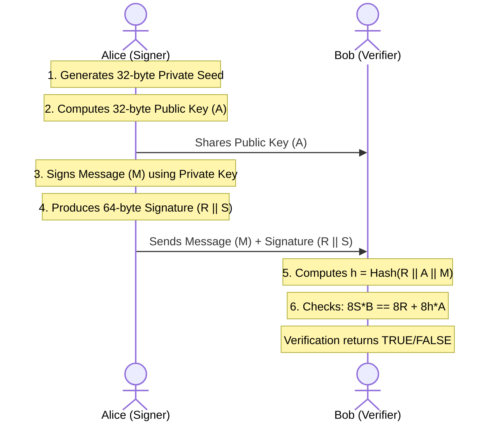

*Last updated: June 17, 2026*

In the modern digital landscape, security is paramount. Whether you are logging into a cloud server via SSH, checking a website over HTTPS, exchanging encrypted messages on your phone, or executing a cryptocurrency transaction, you are relying on asymmetric cryptography to prove your identity and secure your data. 

> **Featured Snippet: What is Ed25519?**
> Ed25519 is a high-performance elliptic curve digital signature scheme (EdDSA) operating over Curve25519. Designed by Daniel J. Bernstein, it offers 128-bit security with tiny 32-byte keys, constant-time execution, and deterministic signatures, making it the modern default for SSH and TLS.

Among the many cryptographic options available, one algorithm has quietly risen to dominate modern systems: **Ed25519**.

But what is Ed25519? What do the numbers mean, why is it so widely recommended by cryptographers, and how does it compare to older standards like RSA? 

This plain-English guide will explore the history, mathematics, safety characteristics, and practical applications of Ed25519 to give you a complete understanding of this modern cryptographic cornerstone.

---

## Table of Contents
1. [The Origin: Why Ed25519 Was Needed](#the-origin-why-ed25519-was-needed)
2. [Decoding the Name: What Does "Ed25519" Mean?](#decoding-the-name-what-does-ed25519-mean)
3. [The Mathematics of Elliptic Curves (Explained Simply)](#the-mathematics-of-elliptic-curves-explained-simply)
4. [In-Depth: The Safety Features of Ed25519](#in-depth-the-safety-features-of-ed25519)
5. [Key and Signature Sizes](#key-and-signature-sizes)
6. [Where is Ed25519 Used?](#where-is-ed25519-used)
7. [Direct Comparison: Ed25519 vs. RSA](#direct-comparison-ed25519-vs-rsa)
8. [Walkthrough: The Digital Signature Lifecycle](#walkthrough-the-digital-signature-lifecycle)
9. [Frequently Asked Questions (FAQs)](#frequently-asked-questions-faqs)
10. [References](#references)

---

## The Origin: Why Ed25519 Was Needed

To understand why Ed25519 was created, we have to look back at the state of public-key cryptography in the early 2000s. At the time, systems relied almost exclusively on two standards:

1. **RSA (Rivest-Shamir-Adleman):** Secure, but slow and clunky. To maintain safety against expanding computing power, RSA key sizes had to grow to 2048, 3072, and 4096 bits, creating massive network and computational overhead.
2. **NIST Elliptic Curves (like P-256):** Standardized by the US National Institute of Standards and Technology (NIST). While they offered smaller keys and faster speeds than RSA, they faced severe criticism. The mathematical constants behind these curves were generated by the NSA in a manner that was not fully transparent, leading to concerns about potential backdoors (a fear later validated by revelations regarding the Dual_EC_DRBG random number generator).

Furthermore, early elliptic curve implementations were notoriously difficult to write securely. A minor mistake in coding, such as a variable execution time or a weak random number generator, could easily leak the private key, leading to major security breaches.

### The Bernstein Revolution
In response to these issues, a team of cryptographers led by **Daniel J. Bernstein (DJB)** introduced **Curve25519** in 2005, followed by **Ed25519** in 2011. 

Bernstein’s goals were clear:
* Create a curve with completely transparent parameters to eliminate backdoor concerns.
* Make the math extremely fast on standard computer processors.
* Design the algorithm to be **misuse-resistant**, making it virtually impossible for developers to introduce side-channel vulnerabilities during implementation.

---

## Decoding the Name: What Does "Ed25519" Mean?

The name "Ed25519" is a combination of its core components:

* **Ed:** Stands for **EdDSA (Edwards-curve Digital Signature Algorithm)**. This is the signing algorithm scheme, which is a modern variant of Schnorr signatures using twisted Edwards curves.
* **25519:** Refers to the underlying elliptic curve, **Curve25519**. The curve is named after the large prime number that defines its mathematical field:
  $$p = 2^{255} - 19$$

So, "Ed25519" means *the Edwards-curve Digital Signature Algorithm operating over Curve25519*. It is standardized by the Internet Engineering Task Force (IETF) in **RFC 8032**.

---

## The Mathematics of Elliptic Curves (Explained Simply)

Unlike RSA, which relies on the difficulty of factoring massive composite prime numbers, Ed25519 relies on the geometry of elliptic curves over finite fields.

### The Curve Equation
Curve25519 is mathematically defined by a twisted Edwards curve equation:
$$-x^2 + y^2 = 1 - \frac{121665}{121666} x^2 y^2$$

This curve is graphed over a finite field using the prime number $2^{255} - 19$. 

### The Discrete Logarithm Problem
If you select a starting point on the curve (called the **Base Point ($B$)**) and multiply it by a secret scalar integer ($s$) using elliptic curve point addition, you get a new point on the curve ($A$):
$$A = s \cdot B$$

In this system:
* The scalar $s$ is your **private key**.
* The resulting point $A$ is your **public key**.

While it is computationally easy to calculate $A$ given $s$ and $B$, it is practically impossible to calculate the private scalar $s$ if you only know the public point $A$ and the base point $B$. This difficulty is known as the **Elliptic Curve Discrete Logarithm Problem (ECDLP)**, and it forms the security foundation of Ed25519.

---

## In-Depth: The Safety Features of Ed25519

Ed25519 is highly regarded not just because of its raw mathematical strength, but because it is designed to prevent common implementation errors.

### 1. Deterministic Signing (Immunity to Randomness Exploits)
Traditional signature schemes like ECDSA require a fresh random number (a nonce) for every single signature. If the random number generator (RNG) is weak, predictable, or repeats even a single value, an attacker can mathematically calculate the private key. This exact vulnerability was used to hack the Sony PlayStation 3 and drain millions of dollars from early mobile Bitcoin wallets.

Ed25519 eliminates this entire failure mode. It does not use the system's random number generator during the signing process. Instead, it generates the nonce deterministically by hashing the private key prefix together with the message using the SHA-512 hash function. The same key and message will always yield the same signature, ensuring that a failing system RNG cannot leak your private key.

### 2. Constant-Time Execution (Side-Channel Resistance)
Computers process different instructions at different speeds. If an algorithm uses conditional branches (like `if/else` statements) based on the private key's bits, an attacker can measure the processing time or power consumption of the CPU to deduce the private key.

Ed25519 was designed from the ground up to execute in **constant time**. The algorithms do not use secret-dependent branching or secret-dependent memory lookups. The code performs the exact same sequence of instructions regardless of the private key's value, neutralizing timing and cache attacks.

### 3. No Configuration Decisions
With RSA, developers must choose a key size (2048, 3072, 4096), a public exponent, and a padding scheme (PKCS#1 v1.5 vs. PSS). A bad choice can compromise security. 

Ed25519 has **zero options**. The curve parameters, base point, hash function, and encoding format are all fixed by the RFC 8032 specification. Developers simply generate a key and sign, eliminating the risk of misconfiguration.

---

## Key and Signature Sizes

One of Ed25519's greatest practical benefits is its small size. Because the mathematics of Curve25519 are highly secure, it achieves strong security with very small values:

| Cryptographic Value | Size in Bytes | Size in Hexadecimal Characters |
| :--- | :--- | :--- |
| **Private Key Seed** | 32 bytes | 64 characters |
| **Public Key** | 32 bytes | 64 characters |
| **Signature** | 64 bytes | 128 characters |

In comparison, a 3072-bit RSA key and signature are **384 bytes** each. By switching to Ed25519, you reduce the size of keys and signatures by over **80%**, saving significant storage and network bandwidth.

---

## Where is Ed25519 Used?

Ed25519 is integrated into many modern protocols and applications:

### 1. SSH (Secure Shell)
For remote server administration, Ed25519 is the recommended standard. OpenSSH (supported on Linux, macOS, and Windows) has supported Ed25519 since version 6.5. For setup details, see our [Ed25519 SSH key guide](/ed25519-ssh-key/).

### 2. Tor Onion Services (v3)
The Tor network uses Ed25519 public keys to define modern version 3 Onion addresses. If you see an address like `pg6x...onion`, the host address itself is a Base32 encoding of the server's Ed25519 public key, allowing you to verify that you are connecting to the correct hidden service.

### 3. Secure Messaging (The Signal Protocol)
The Signal Protocol, which secures end-to-end encryption for WhatsApp, Signal, and Google Messages, uses Curve25519 for identity keys and session handshakes, using Ed25519 signatures to verify the identity of the participants.

### 4. Blockchains and Cryptocurrencies
Because blockchains require verifying thousands of transaction signatures per second, they need highly efficient algorithms. Solana, Cardano, NEAR, and Stellar all use Ed25519 for account creation and transaction signing.

### 5. DNSSEC (Domain Name System Security Extensions)
DNSSEC signs DNS records to prevent spoofing. RFC 8080 added support for Ed25519, allowing DNS zones to be secured with smaller signatures, reducing the size of DNS response packets and mitigating DNS amplification DDoS attacks.

---

## Direct Comparison: Ed25519 vs. RSA

Here is a summary comparison between Ed25519 and a standard 3072-bit RSA key (matching Ed25519's ~128-bit security level).

| Feature | Ed25519 | RSA (3072-bit) |
| :--- | :--- | :--- |
| **Public Key Size** | 32 bytes | 384 bytes |
| **Signature Size** | 64 bytes | 384 bytes |
| **Signing Performance** | Extremely Fast | Slow |
| **Verification Performance** | Fast | Extremely Fast |
| **Implementation Safety** | High (constant-time, deterministic) | Medium (complex blinding required) |
| **Legacy Compatibility** | OpenSSH 6.5+ (2014) | Universal |

For a deep-dive performance and security analysis, check our detailed [Ed25519 vs RSA guide](/blog/ed25519-vs-rsa/).

---

## Walkthrough: The Digital Signature Lifecycle

To understand how Ed25519 works in practice, let's look at the lifecycle of a digital signature:

1. **Key Generation:** Alice generates a 32-byte private seed, hashes and clamps it, and multiplies it by the base point to produce her 32-byte public key. She shares her public key with Bob.
2. **Signing:** Alice writes a message. Her signing software hashes the message with her private key prefix to generate a deterministic nonce, calculates a commitment point $R$, and computes $S$. The combined 64-byte signature is sent to Bob alongside the message.
3. **Verification:** Bob receives the message and the signature. His software performs the elliptic curve verification equation. If it balances, Bob knows the message is authentic and unaltered.

---

## Frequently Asked Questions (FAQs)

### Q1: What does the "25519" stand for in Ed25519?
The number "25519" refers to the prime number $2^{255} - 19$ which defines the finite field that the underlying elliptic curve, Curve25519, operates on.

### Q2: Can Ed25519 be used to encrypt data?
No. Ed25519 is strictly a signature scheme. If you need to encrypt data using the same mathematical curve, you should use the X25519 key exchange protocol to establish a shared symmetric key, and then encrypt the data using a symmetric cipher like AES or ChaCha20. Refer to [X25519 vs Ed25519](/blog/x25519-vs-ed25519/) for details.

### Q3: Is Ed25519 safer than ECDSA?
Yes, in practice. While both offer similar mathematical security margins at equivalent key sizes, ECDSA requires a cryptographically secure random value (nonce) for every signature. If the random number generator fails or is weak, ECDSA leaks the private key. Ed25519 is deterministic and does not rely on per-signature randomness, making it far safer against implementation errors.

### Q4: Why are Ed25519 keys so small?
Ed25519 is based on elliptic curve cryptography, which is mathematically harder to solve using known algorithms compared to RSA's integer factorization. Therefore, a 256-bit elliptic curve key offers the same security level (~128-bit symmetric strength) as a massive 3072-bit RSA key.

### Q5: How do I generate an Ed25519 SSH key?
You can generate one using OpenSSH by running the following command in your terminal:
`ssh-keygen -t ed25519 -C "your_email@example.com"`
For a detailed guide, see [Ed25519 SSH key guide](/ed25519-ssh-key/).

---

## About the Author

**Written by Zeeshan Tariq**

Software engineer focused on cryptography, authentication systems, and full-stack development. Zeeshan has designed secure authentication integrations for enterprise cloud systems and regularly audits cryptographic configurations.

---

## References
1. Bernstein, D. J., Duif, N., Lange, T., Schwab, P.-Y., & Yang, B.-Y. (2012). *High-speed high-security signatures*. Journal of Cryptographic Engineering, 2(2), 77-89. [https://ed25519.cr.yp.to/ed25519-20110926.pdf](https://ed25519.cr.yp.to/ed25519-20110926.pdf)
2. Josefsson, S., & Liusvaara, I. (2017). *Edwards-Curve Digital Signature Algorithm (EdDSA)*. RFC 8032. IETF. [https://tools.ietf.org/html/rfc8032](https://tools.ietf.org/html/rfc8032)
3. Barker, E. (2020). *Recommendation for Key Management: Part 1 - General*. NIST SP 800-57 Part 1 Rev. 5. National Institute of Standards and Technology. [https://doi.org/10.6028/NIST.SP.800-57pt1r5](https://doi.org/10.6028/NIST.SP.800-57pt1r5)
4. IETF. (2016). *Use of Ed25519 Algorithms in the Internet Key Exchange Protocol Version 2 (IKEv2)*. RFC 8031. [https://tools.ietf.org/html/rfc8031](https://tools.ietf.org/html/rfc8031)

