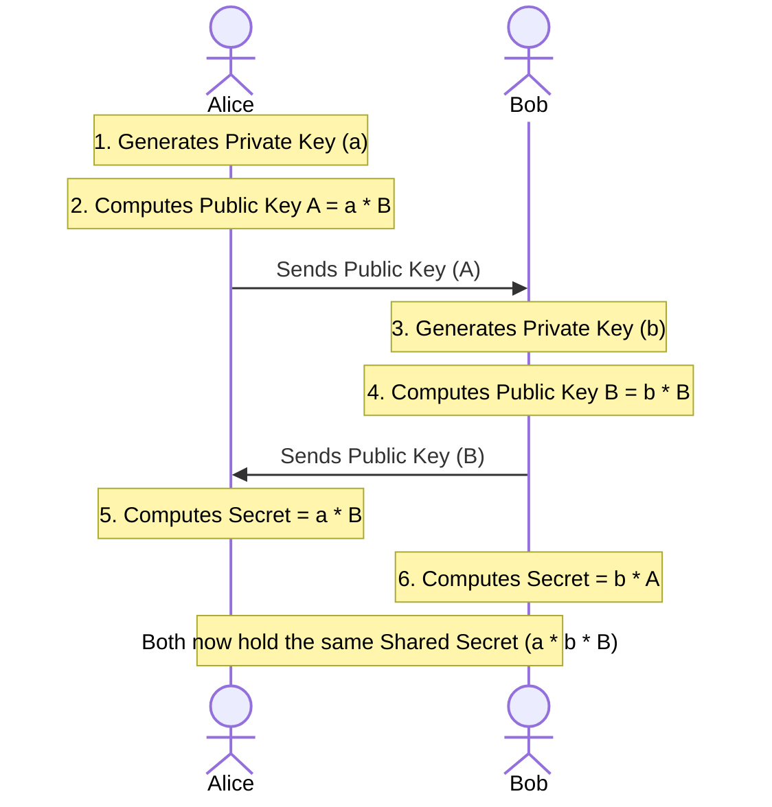
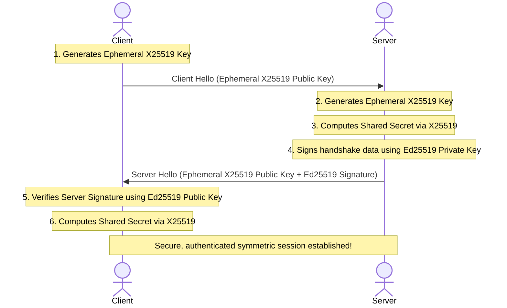

*Last updated: June 17, 2026*

In modern cryptography, the numbers "25519" carry a reputation for speed, security, and simplicity. Developed by cryptographer Daniel J. Bernstein, Curve25519 has become the industry standard for securing network connections. However, developers and security enthusiasts often find themselves confused by two closely related terms: **X25519** and **Ed25519**.

> **Featured Snippet: What is the difference between X25519 and Ed25519?**
> The difference between X25519 and Ed25519 lies in their application. X25519 is an Elliptic Curve Diffie-Hellman (ECDH) key exchange protocol used to establish shared secrets for data encryption, while Ed25519 is an EdDSA digital signature scheme used to prove identity and verify data integrity.


Are they the same thing? Do they use the same keys? Can you convert one to the other?

The short answer is: **X25519 and Ed25519 are built on the same underlying elliptic curve, but they perform different roles.** X25519 is designed for **key exchange** (establishing a shared secret to encrypt data), whereas Ed25519 is designed for **digital signatures** (proving identity and message integrity).

This comprehensive guide explores the mathematics, curve forms, security best practices, and integration workflows of X25519 and Ed25519 to clarify their roles in modern secure communication.

---

## Table of Contents
1. [At a Glance: Key Differences](#at-a-glance-key-differences)
2. [The Origin: Bernstein's Curve25519 Design Goals](#the-origin-bernsteins-curve25519-design-goals)
3. [Same Curve, Different Forms](#same-curve-different-forms)
4. [Birational Equivalence: Converting Keys](#birational-equivalence-converting-keys)
5. [Why You Should Not Reuse Keys Across Both Protocols](#why-you-should-not-reuse-keys-across-both-protocols)
6. [Deep Dive: How X25519 Diffie-Hellman Works](#deep-dive-how-x25519-diffie-hellman-works)
7. [Combined Workflow: Establishing a Secure Session](#combined-workflow-establishing-a-secure-session)
8. [Frequently Asked Questions (FAQs)](#frequently-asked-questions-faqs)
9. [References](#references)

---

## At a Glance: Key Differences

Before diving into the mathematics, here is a high-level comparison of how X25519 and Ed25519 function:

| Feature | Ed25519 | X25519 |
| :--- | :--- | :--- |
| **Primary Job** | Digital **Signatures** | **Key Agreement** (Key Exchange) |
| **Cryptographic Scheme** | EdDSA (Edwards-curve Digital Signature Algorithm) | ECDH (Elliptic Curve Diffie-Hellman) |
| **Curve Form** | Twisted Edwards curve | Montgomery curve |
| **Mathematical Equation** | $-x^2 + y^2 = 1 - \frac{121665}{121666} x^2 y^2$ | $y^2 = x^3 + 486662 x^2 + x$ |
| **Key Size** | Public: 32 bytes, Private: 32 bytes | Public: 32 bytes, Private: 32 bytes |
| **Typical Use Cases** | SSH authentication, code signing, JWTs, Git commits | TLS 1.3 handshakes, Signal/WhatsApp chat encryption |
| **Standardization** | RFC 8032 | RFC 7748 |

---

## The Origin: Bernstein's Curve25519 Design Goals

To understand why X25519 and Ed25519 exist, we must look at Curve25519's history. 

In 2005, Daniel J. Bernstein released Curve25519 as an Elliptic Curve Diffie-Hellman (ECDH) key exchange protocol. The design was revolutionary because it addressed both security and performance limitations of older standards:
1. **Speed:** The math was optimized to execute extremely fast on 32-bit and 64-bit architectures, avoiding slow division operations.
2. **Timing Attack Resilience:** The operations were designed to execute in constant time, meaning timing side-channels could not leak key information.
3. **No Bad Curve Parameters:** The curve parameters were chosen transparently to prevent potential backdoors.
4. **Vulnerability Shielding:** The curve has a prime order subgroup, making it highly resistant to small-subgroup attacks.

When Bernstein first published Curve25519, he specified it in a coordinate format optimized for key exchange. Over time, as the community requested a matching digital signature scheme, Bernstein and his colleagues developed a twisted Edwards curve representation of the same mathematics. This signature-focused implementation became **Ed25519**.

---

## Same Curve, Different Forms

X25519 and Ed25519 operate on the same mathematical field, but they represent the curve differently to optimize performance for their respective tasks.

### 1. X25519: The Montgomery Form
X25519 is defined using a **Montgomery curve**. The equation is:
$$y^2 = x^3 + 486662 x^2 + x$$

#### Why Montgomery Form?
Montgomery curves allow for an algorithm called the **Montgomery Ladder**. This algorithm performs scalar multiplication using only the $x$-coordinate of points on the curve, ignoring the $y$-coordinate entirely. 

This simplifies the math:
* Operations use less memory and CPU cycles.
* The code is easy to write in constant-time, protecting against side-channel analysis.
* Since only the $x$-coordinate is stored, public keys are always exactly 32 bytes.

This form is ideal for Elliptic Curve Diffie-Hellman (ECDH) key exchange, where fast scalar multiplication is the primary performance bottleneck.

### 2. Ed25519: The Twisted Edwards Form
Ed25519 is defined using a **twisted Edwards curve**. The equation is:
$$-x^2 + y^2 = 1 - \frac{121665}{121666} x^2 y^2$$

#### Why Twisted Edwards Form?
Digital signature schemes require adding arbitrary points on a curve together, rather than just multiplying a point by a scalar. 

Twisted Edwards curves allow for **complete addition formulas**. This means the mathematical formula used to add two points $P$ and $Q$ works for *any* points on the curve, including doubling a point ($P = Q$) or adding the point at infinity. 

Standard curves (like Weierstrass curves) require separate branching logic to handle these edge cases. Complete addition formulas eliminate this branching, reducing implementation complexity and timing side-channels during signing and verification.

---

## Birational Equivalence: Converting Keys

Because X25519 and Ed25519 are different representations of the same mathematical curve, they are **birationally equivalent**. This means there is a direct mathematical mapping to convert points from the Montgomery curve to the twisted Edwards curve, and vice versa.

### The Conversion Formula
A point $(u, v)$ on the Montgomery curve (X25519) maps to a point $(x, y)$ on the twisted Edwards curve (Ed25519) using the following transformations:
$$x = \frac{u}{\sqrt{486662} \cdot v}$$
$$y = \frac{u - 1}{u + 1}$$

And the reverse transformation:
$$u = \frac{1 + y}{1 - y}$$

### Code Implementation: Converting Keys in Libsodium
Cryptographic libraries like `libsodium` include helper functions to convert an Ed25519 public key to an X25519 public key:

```c
#include <sodium.h>

// Convert Ed25519 public key to X25519 public key
unsigned char ed25519_pk[32]; // input
unsigned char x25519_pk[32];  // output

if (crypto_sign_ed25519_pk_to_curve25519(x25519_pk, ed25519_pk) != 0) {
    // Handle error
}
```

Similarly, the private key seed can be mapped directly to generate matching X25519 key agreements.

---

## Why You Should Not Reuse Keys Across Both Protocols

Because conversion is mathematically simple, developers often ask: **Can I use my Ed25519 signature key as an X25519 encryption key to simplify key management?**

While mathematically possible, **key reuse across different protocols is highly discouraged** by cryptographers.

### 1. Cross-Protocol Attacks
If you use the same key pair for two different cryptographic algorithms, an attacker might capture a signature from the Ed25519 protocol and reuse those bytes to exploit a weakness in the X25519 key exchange protocol, or vice versa. While there are no known practical attacks targeting Curve25519 key reuse today, separating keys is a fundamental security practice to prevent future vulnerabilities.

### 2. Differing Threat Models and Lifecycles
Signature keys and encryption keys have different lifecycles and security requirements:
* **Decryption keys** are highly sensitive and must be backed up to prevent losing access to encrypted data. If a user loses their laptop, they need a backup of their X25519 key to read historical messages.
* **Signing keys** should never be backed up in multiple locations, as unauthorized access allows key compromise. If a user loses their laptop, they simply generate a new Ed25519 key, register it on their servers, and revoke the old one.

Using separate keys for encryption and signing keeps your security policies clean and prevents a compromise in one protocol from affecting the other.

---

## Deep Dive: How X25519 Diffie-Hellman Works

To understand how X25519 establishes encryption, let's look at the Elliptic Curve Diffie-Hellman (ECDH) protocol.

Imagine Alice and Bob want to establish an encrypted connection, but an attacker (Eve) is monitoring their traffic.



1. **Key Generation:**
   * Alice generates a private key $a$ (a random 32-byte scalar) and computes her public key $A = a \cdot B$ (where $B$ is the base point).
   * Bob generates a private key $b$ and computes his public key $B = b \cdot B$.
2. **Public Key Exchange:**
   * Alice sends her public key $A$ to Bob.
   * Bob sends his public key $B$ to Alice.
3. **Shared Secret Calculation:**
   * Alice multiplies Bob's public key by her private key:
     $$\text{Secret} = a \cdot B = a \cdot (b \cdot B) = (a \cdot b) \cdot B$$
   * Bob multiplies Alice's public key by his private key:
     $$\text{Secret} = b \cdot A = b \cdot (a \cdot B) = (b \cdot a) \cdot B$$

Both now hold the same mathematical point on the curve, $(a \cdot b) \cdot B$, representing their **shared secret**. Eve, who only intercepted $A$ and $B$, cannot calculate this secret due to the discrete logarithm problem. 

Alice and Bob pass this shared secret through a Key Derivation Function (KDF) to generate a symmetric key (such as an AES or ChaCha20 key) to encrypt all subsequent communication.

---

## Combined Workflow: Establishing a Secure Session

In real-world security protocols like TLS 1.3 (HTTPS) and SSH, X25519 and Ed25519 are combined to establish a secure, authenticated connection.

Here is a simplified trace of how they work together during a connection handshake:



1. **The Client Initiates:** The client generates an ephemeral (temporary) X25519 key pair and sends the public key to the server in a "Client Hello" packet.
2. **The Server Responds:** The server generates its own ephemeral X25519 key pair, calculates the shared secret, and signs the handshake data using its long-term **Ed25519 private key**. It sends the public key and signature back to the client.
3. **The Client Verifies:** The client verifies the server's Ed25519 signature using the server's published public key to confirm they are talking to the real server (preventing MITM attacks).
4. **Encryption Established:** The client calculates the shared secret using X25519, derives the symmetric session keys, and begins sending encrypted application data.

By combining the two protocols, the connection achieves **confidentiality** (via X25519 key agreement) and **authenticity** (via Ed25519 signatures).

---

## Frequently Asked Questions (FAQs)

### Q1: Can X25519 keys be converted to Ed25519 keys?
Yes, mathematically they are birationally equivalent and can be mapped. However, because X25519 public keys do not contain the $y$-coordinate sign bit, converting from X25519 to Ed25519 requires guessing which of the two possible signs is correct, whereas converting from Ed25519 to X25519 is completely straightforward.

### Q2: Why is key reuse discouraged if they are on the same curve?
Key reuse across two different protocols (such as EdDSA signing and ECDH key agreement) introduces the risk of cross-protocol attacks, where output from one protocol is used to exploit a weakness in the other. It also complicates key management lifecycles since signing keys and decryption keys have different backup requirements.

### Q3: What is the main speed difference between X25519 and Ed25519?
X25519 operates on the Montgomery form of the curve, which allows for extremely fast scalar multiplication using only the $x$-coordinate (Montgomery Ladder). Ed25519 uses the twisted Edwards form, which is optimized for point additions and signature verification algorithms.

### Q4: Does TLS 1.3 use X25519 or Ed25519?
It uses both. During the TLS 1.3 handshake, X25519 is used for the ephemeral key exchange (ECDH) to establish the encryption keys, while Ed25519 is used for the digital signatures to authenticate the server's identity.

### Q5: Is X25519 standard in OpenSSH?
Yes. OpenSSH uses X25519 (specifically `curve25519-sha256@libssh.org` or `curve25519-sha256`) as the default key exchange method to negotiate connection encryption.

---

## About the Author

**Written by Zeeshan Tariq**

Software engineer focused on cryptography, authentication systems, and full-stack development. Zeeshan has designed secure authentication integrations for enterprise cloud systems and regularly audits cryptographic configurations.


---

## References
1. Bernstein, D. J. (2006). *Curve25519: new Diffie-Hellman speed records*. Public Key Cryptography - PKC 2006, 207-228. [https://cr.yp.to/ecdh/curve25519-20060209.pdf](https://cr.yp.to/ecdh/curve25519-20060209.pdf)
2. Langley, A., Hamburg, M., & Turner, S. (2016). *Elliptic Curves for Security*. RFC 7748. Internet Engineering Task Force. [https://tools.ietf.org/html/rfc7748](https://tools.ietf.org/html/rfc7748)
3. Josefsson, S., & Liusvaara, I. (2017). *Edwards-Curve Digital Signature Algorithm (EdDSA)*. RFC 8032. IETF. [https://tools.ietf.org/html/rfc8032](https://tools.ietf.org/html/rfc8032)
4. Rescorla, E. (2018). *The Transport Layer Security (TLS) Protocol Version 1.3*. RFC 8446. Internet Engineering Task Force. [https://tools.ietf.org/html/rfc8446](https://tools.ietf.org/html/rfc8446)

<script type="application/ld+json">
{
  "@context": "https://schema.org",
  "@type": "Article",
  "headline": "X25519 vs Ed25519: what is the difference?",
  "description": "Understand the difference between X25519 and Ed25519, their mathematical curve coordinate transformations, and how they secure connections in hybrid cryptosystems.",
  "author": {
    "@type": "Person",
    "name": "Zeeshan Tariq"
  },
  "datePublished": "2026-06-17",
  "dateModified": "2026-06-18"
}
</script>

<script type="application/ld+json">
{
  "@context": "https://schema.org",
  "@type": "FAQPage",
  "mainEntity": [
    {
      "@type": "Question",
      "name": "Can X25519 keys be converted to Ed25519 keys?",
      "acceptedAnswer": {
        "@type": "Answer",
        "text": "Yes. Because they share the same underlying Montgomery/Edwards Curve25519 geometry, you can mathematically map public keys between X25519 and Ed25519 using birational equivalence."
      }
    },
    {
      "@type": "Question",
      "name": "Why is key reuse discouraged if they are on the same curve?",
      "acceptedAnswer": {
        "@type": "Answer",
        "text": "Reusing the exact same private key for both signing and encryption introduces cross-protocol vulnerabilities, potentially allowing an attacker to decrypt traffic using signed messages."
      }
    },
    {
      "@type": "Question",
      "name": "What is the main speed difference between X25519 and Ed25519?",
      "acceptedAnswer": {
        "@type": "Answer",
        "text": "Both are extremely fast, but X25519 performs a single coordinate scalar multiplication on a Montgomery curve, while Ed25519 requires full point additions and doubling on a twisted Edwards curve."
      }
    },
    {
      "@type": "Question",
      "name": "Does TLS 1.3 use X25519 or Ed25519?",
      "acceptedAnswer": {
        "@type": "Answer",
        "text": "TLS 1.3 uses both. It uses X25519 for ephemeral key exchange to encrypt the session payload, and Ed25519 for server digital certificates to verify the server's identity."
      }
    },
    {
      "@type": "Question",
      "name": "Is X25519 standard in OpenSSH?",
      "acceptedAnswer": {
        "@type": "Answer",
        "text": "Yes. OpenSSH uses curve25519-sha256 (which runs X25519) as the default key exchange algorithm for negotiating connections."
      }
    }
  ]
}
</script>

<script type="application/ld+json">
{
  "@context": "https://schema.org",
  "@type": "BreadcrumbList",
  "itemListElement": [
    {
      "@type": "ListItem",
      "position": 1,
      "name": "Blog",
      "item": "https://ed25519.com/blog/"
    },
    {
      "@type": "ListItem",
      "position": 2,
      "name": "X25519 vs Ed25519",
      "item": "https://ed25519.com/blog/x25519-vs-ed25519/"
    }
  ]
}
</script>
